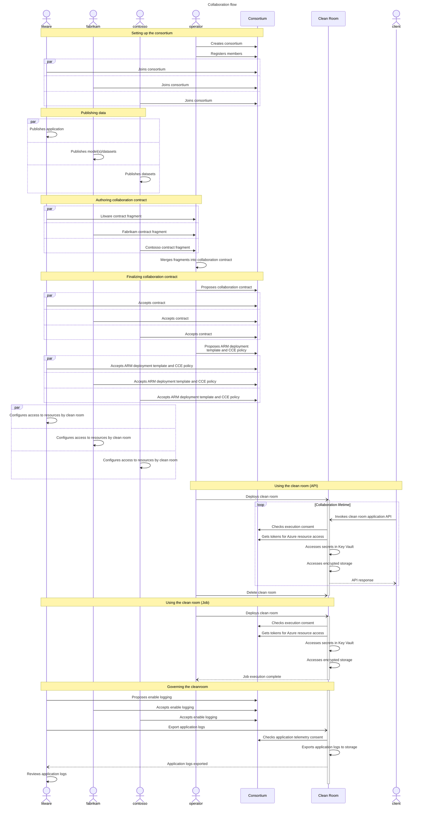
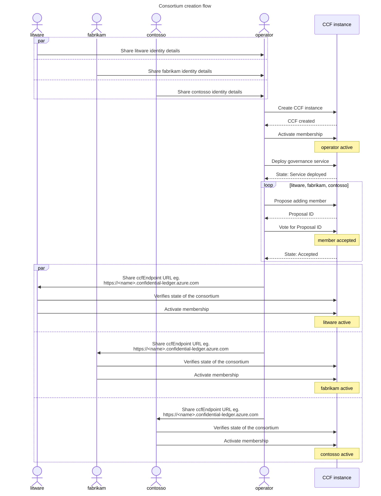
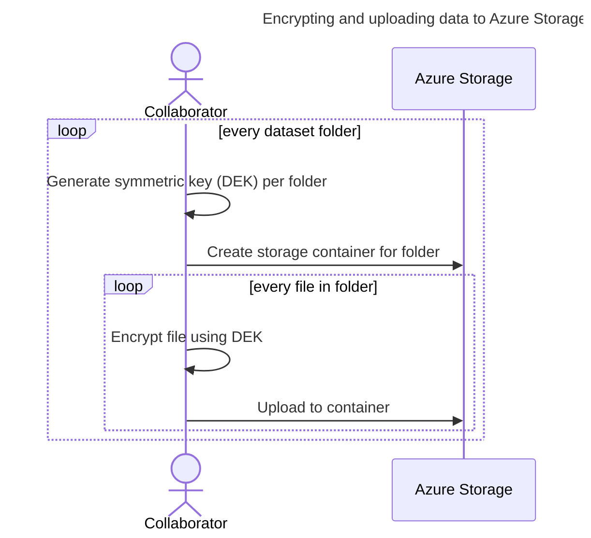
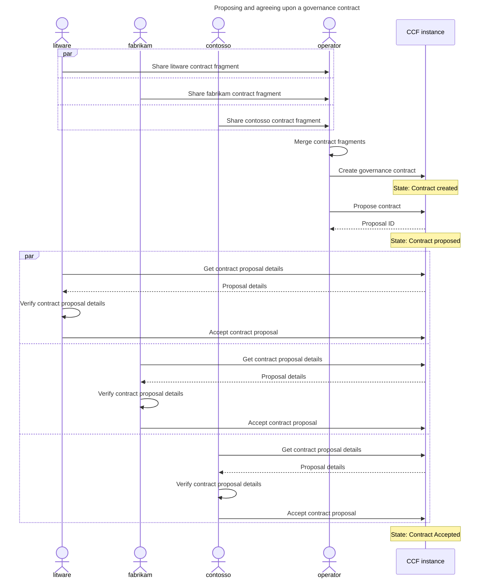
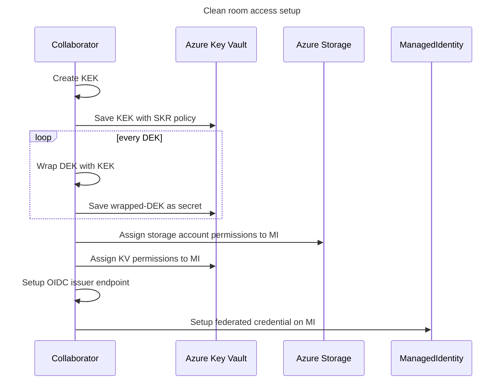

# Multi-party collaboration <!-- omit from toc -->

These samples demonstrate usage of an Azure **_Confidential Clean Room_** (**CCR**) for multi-party collaboration for the following scenarios:
- Confidential access of protected data. [Job] / [API]
- Confidential execution of audited queries on protected datasets using a standalone DB engine residing within the CCR. [Analytics]
- Confidential inference from sensitive data using a protected ML model. [Inference]
- Confidential fine tuning of a protected ML model on protected datasets. [Training]

<!-- simple-api [API]
    litwareinc - hitcount app in, logs and telemetry out
    fabrikam - file in, nothing out
    contosso - file in, nothing out
    consumer - API request match-word in, API response hitcount out

simple-job [Job]
    litwareinc - reverse app in, logs and telemetry out
    fabrikam - input-file in, reversed-file out
    contosso - NA
    consumer - NA

analytics [API]
    litwareinc - query app and query documents in, logs and telemetry out
    fabrikam - dataset in, nothing out
    contosso - dataset in, nothing out
    consumer - API request query-id, query-params in, API response query-result out

inference [API]
    litwareinc - inference app in, logs and telemetry out
    fabrikam - model in, nothing out
    contosso - NA
    consumer - API request private-data in, API response inference-result out

tuning [Job]
    litwareinc - training app in, logs and telemetry out
    fabrikam - initial-model in, tuned-model out
    contosso - dataset in, nothing out
    consumer - NA

collab-common
    pre - setup consortium for litwareinc, fabrikam & contosso
    flow - contract and template proposals, idp -->

# Table of Contents <!-- omit from toc -->
<!--
  DO NOT UPDATE THIS MANUALLY

  The TOC is managed using the "Markdown All in One" extension.
  Use the extension commands to auto-update the TOC and section numbers.
-->
- [Overview](#overview)
- [Samples environment (per collaborator)](#samples-environment-per-collaborator)
  - [Bringing up the environment](#bringing-up-the-environment)
  - [Initializing the environment](#initializing-the-environment)
- [High level execution sequence](#high-level-execution-sequence)
- [Setting up the consortium](#setting-up-the-consortium)
  - [Member identity creation (litware, fabrikam, contosso)](#member-identity-creation-litware-fabrikam-contosso)
  - [Create the CCF instance (operator)](#create-the-ccf-instance-operator)
  - [Invite members to the consortium (operator)](#invite-members-to-the-consortium-operator)
  - [Join the consortium (litware, fabrikam, contosso)](#join-the-consortium-litware-fabrikam-contosso)
- [Publishing data](#publishing-data)
  - [KEK-DEK based encryption approach](#kek-dek-based-encryption-approach)
  - [Encrypt and upload data (fabrikam, contosso)](#encrypt-and-upload-data-fabrikam-contosso)
- [Authoring collaboration contract](#authoring-collaboration-contract)
  - [Initializing a contract fragment (litware, fabrikam, contosso)](#initializing-a-contract-fragment-litware-fabrikam-contosso)
  - [Adding data sets to the contract (fabrikam, contosso)](#adding-data-sets-to-the-contract-fabrikam-contosso)
  - [Adding application to the contract (litware)](#adding-application-to-the-contract-litware)
  - [Setting up log collection (litware)](#setting-up-log-collection-litware)
- [Finalizing collaboration contract](#finalizing-collaboration-contract)
  - [Proposing a governance contract (operator)](#proposing-a-governance-contract-operator)
  - [Agreeing upon the contract (litware, fabrikam, contosso)](#agreeing-upon-the-contract-litware-fabrikam-contosso)
  - [Propose ARM template, CCE policy and log collection (operator)](#propose-arm-template-cce-policy-and-log-collection-operator)
  - [Accept ARM template, CCE policy and logging proposals (litware, fabrikam, contosso)](#accept-arm-template-cce-policy-and-logging-proposals-litware-fabrikam-contosso)
  - [Configure resource access for clean room (litware, fabrikam, contosso)](#configure-resource-access-for-clean-room-litware-fabrikam-contosso)
- [Using the clean room](#using-the-clean-room)
  - [Deploy clean room (operator)](#deploy-clean-room-operator)
  - [Download encrypted output](#download-encrypted-output)
- [Governing the cleanroom](#governing-the-cleanroom)
  - [Download and share logs](#download-and-share-logs)
  - [Explore the downloaded logs](#explore-the-downloaded-logs)
  - [View telemetry for infrastucture containers](#view-telemetry-for-infrastucture-containers)
  - [See audit events](#see-audit-events)
- [Next Steps](#next-steps)
  - [Contributing](#contributing)
  - [Trademarks](#trademarks)

# Overview
All the scenarios demonstrate collaborations where one or more of the following parties come together:
  - **_Litware_**, end to end solution developer publishing applications that execute within the CCR.
  - **_Fabrikam_**, collaborator owning sensitive dataset(s) and protected AI model(s) that can be consumed by applications inside a CCR.
  - **_Contosso_**, collaborator owning sensitive dataset(s) that can be consumed by applications inside a CCR.
  
The following parties are additionally involved in completing the end to end scenario:
  - **_Client_**, consumer invoking the CCR endpoint to gather insights, without any access to the protected data itself.
  - **_Operator_**, clean room provider hosting the CCR infrastructure.

In all cases, a CCR will be executed to run the application while protecting the privacy of all ingested data, as well as protecting any confidential output. The CCR instance can be deployed by the **_operator_**, any of the collaborators or even the **_client_** without any impact on the zero-trust promise architecture.

<!-- TODO: We need to figure out how to capture this better as "capabilities" is an odd name for showcasing features. Maybe a features demonstrated table? -->
<!-- Capabilities demonstrated:
- How to encrypt and publish sensitve data such that it can be decrypted only within a CCR
- How to encrypt and output sensitive data from within the CCR such that it can only read by intended party
- How to exchange information about the published (encrypted) data and the clean room application between the collaborating parties
- How to create a governance contract capturing the application to be executed in the clean room and the data to be made available to it
- How to agree upon ARM templates and confidential computation security policy (CCE) that will be used for deploying the CCR
- How to enable collection of CCR execution logs and inspect the same in a confidential manner -->

# Samples environment (per collaborator)
All the involved parties need to bring up a local environment to participate in the sample collaborations.

## Bringing up the environment
> [!NOTE] Prerequisites to bring up the environment
> * Docker installed locally. Installation instructions [here](https://docs.docker.com/engine/install/).
> * Powershell installed locally. Installation instructions [here](https://learn.microsoft.com/en-us/powershell/scripting/install/installing-powershell).

```powershell
# Launch a pre-built docker container to create an environment in the context of one of the parties.
$memberName = "<persona>" # ("litware", "fabrikam", "contosso", "client", "operator")
./start-environment.ps1 -memberName $memberName
```

<br>
<details><summary><em>Executing the configuration steps manually</em></summary>
<br>

  We recommend running the following steps in PowerShell on WSL using Ubuntu 22.04.
  - Instructions for setting up WSL can be found [here](https://learn.microsoft.com/en-us/windows/wsl/install).
  - To install PowerShell on WSL, follow the instructions [here](https://learn.microsoft.com/en-us/powershell/scripting/install/install-ubuntu?view=powershell-7.3).

  To set the samples environment up, we will need the following tools to be installed prior to running the setup scripts.
  1. Azure CLI version >= 2.57. Installation instructions [here](https://learn.microsoft.com/en-us/cli/azure/install-azure-cli-linux).
  1. You need Docker for Linux installed locally. Installation instructions [here](https://docs.docker.com/engine/installation/#supported-platforms).
  1. Confidential containers Azure CLI extension, version >= 0.3.5. You can install this extension using ```az extension add --name confcom -y```. You can check the version of the extension using ```az extension show --name confcom```. Learn about it [here](https://learn.microsoft.com/en-us/cli/azure/confcom?view=azure-cli-latest).
  1. Managed CCF Azure CLI extension. You can install this extension using ```az extension add --name managedccfs -y```.
  1. azcopy versions >= 10.25.0. Installation instructions [here](https://learn.microsoft.com/en-us/azure/storage/common/storage-use-azcopy-v10).
  1. openssl - Download instructions for Linux [here](https://www.openssl.org/source/).
  1. jq - Download / install instructions for Linux [here](https://jqlang.github.io/jq/download/).
  1. Add the CleanRoom Azure CLI extension using:
      ```powershell
      az extension add --source https://cleanroomazcli.blob.core.windows.net/azcli/cleanroom-0.0.3-py2.py3-none-any.whl -y --allow-preview true
      ```
  1. Set the environment variable "MEMBER_NAME" to one of the following parties - "litware", "fabrikam", "contosso", "client", "operator"
  1. Set the environment variable "RESOURCE_GROUP" to the name of Azure Resource Group to be used for creating resources.

</details>
<br>

## Initializing the environment
> [!NOTE] Prerequisites to initialize the environment
> * An Azure subscription with adequate permissions to create resources and manage permissions on these resources.

Once the environment is setup, initialize it for executing the samples by executing the following command from the `/home/samples` directory:

```powershell
# Login to Azure. If required, set the subscription.
az login

# Create the resource group and other Azure resources required for executing the samples such as a storage account and key vault (Premium).
./scripts/initialize-environment.ps1
```

> [!IMPORTANT]
> All the steps henceforth assume that you are working in the `/home/samples` directory of the docker container, and commands are executed relative to that path.

# High level execution sequence
The sequence diagram below captures the overall flow of execution that happens across the samples being demonstrated. It might be helpful to keep this high level perspective in mind as you run through the steps.

<br>

<!-- TODO: Update block diagram to be more generic. -->
<!-- Once the clean room is deployed the key components involved during execution are shown below:

 -->

# Setting up the consortium
Collaboration using a CCR is realized and governed through a consortium created in [CCF](https://microsoft.github.io/CCF/main/overview/what_is_ccf.html) hosting a [Clean Room Governance Service (CGS)](../../src/governance/README.md). All the collaborating parties become participating members in the consortium.

From a confidentiality perspective any of the collaborators or the *operator* can create the CCF instance without affecting the zero-trust assurances. In these samples, we assume that it was agreed upon that the *operator* will host the CCF instance. The *operator* would create the CCF instance and then invite all the collaborators as members into the consortium.



## Member identity creation (litware, fabrikam, contosso)
A CCF member is identified by a public-key certificate used for client authentication and command signing. Each member of the collaboration creates their member identity by generating their public and private key pair.

```powershell
./scripts/consortium/initialize-member.ps1
```

Above command shows output similar to below.

```
-- Generating identity private key and certificate for participant "contosso"...
Identity curve: secp384r1
Identity private key generated at:   ./demo-resources.secret/contosso_privk.pem
Identity certificate generated at:   ./demo-resources.secret/contosso_cert.pem (to be registered in CCF)
-- Generating RSA encryption key pair for participant "contosso"...
writing RSA key
Encryption private key generated at:  ./demo-resources.secret/contosso_enc_privk.pem
Encryption public key generated at:   ./demo-resources.secret/contosso_enc_pubk.pem (to be registered in CCF)
```

The above command will generate the public/private key pair. The member’s identity private key (e.g. `contosso_privk.pem`) should be stored on a trusted device (e.g. HSM) and kept private (not shared with any other member) while the certificate (e.g. `contosso_cert.pem`) would be registered in CCF (later in the flow).


## Create the CCF instance (operator)

Run the below steps to create the CCF instance.

```powershell
./scripts/consortium/start-consortium.ps1
```

## Invite members to the consortium (operator)
The _operator_ (who is hosting the CCF instance) registers each member of the collaboration with the consortium using the identity details generated [above](#member-identity-creation-litware-fabrikam-contosso) by running this command:


```powershell
./scripts/consortium/register-member.ps1
```

> [!WARNING]
> In the default sample environment, the containers for all participants have their `/home/samples/demo-resources.public` mapped to a single host directory, so this identity information would be available to all parties automatically once generated. If not, the identity details of all other parties needs to made available in `/home/samples/demo-resources.public` of the _operator's_ environment before running the registration command above.

## Join the consortium (litware, fabrikam, contosso)
Once the collaborators have been added, they now need to activate their membership before they can participate in the collaboration. The operator must share the `ccfEndpoint` value to the collaborators so they can know which CCF instance to connect to.

```powershell
./scripts/consortium/confirm-member.ps1
```

With the above steps the consortium creation that drives the creation and execution of the clean room is complete. We now proceed to preparing the datasets and making them available in the clean room.

> [!TIP]
> The same consortium can be used/reused for executing any/all the sample scenarios. There is no need to repeat these steps unless the collaborators have changed. 

# Publishing data
Sensitive data that any of the parties want to bring into the collaboration needs to be encrypted in a manner that ensures the key to decrypt this data will only be released to the clean room environment. 

## KEK-DEK based encryption approach
The samples follow an envelope encryption model for encryption of data. For the encryption of the data, a symmetric **_Data Encryption Key_** (**DEK**) is generated. An asymmetric key, called the *Key Encryption Key* (KEK), is generated subsequently to wrap the DEK. The wrapped DEKs are stored in a Key Vault as a secret and the KEK is imported into an MHSM/Premium Key Vault behind a secure key release (SKR) policy. Within the clean room, the wrapped DEK is read from the Key Vault and the KEK is retrieved from the MHSM/Premium Key Vault following the secure key release [protocol](https://learn.microsoft.com/en-us/azure/confidential-computing/concept-skr-attestation). The DEKs are unwrapped within the cleanroom and then used to access the storage containers.

## Encrypt and upload data (fabrikam, contosso)
It is assumed that the collaborators have had out-of-band communication and have agreed on the data sets that will be shared. In these samples, the protected data is in the form of one or more files in one or more directories at each collaborators end.

These dataset(s) in the form of files are encrypted using the [KEK-DEK](#kek-dek-based-encryption-approach) approach and uploaded into the the storage account created as part of [initializing the sample environment](#initializing-the-environment). Each directory in the source dataset would correspond to one Azure Blob storage container, and all files in the directory are uploaded as blobs to Azure Storage using specified encryption mode - [client-side encryption]() / server-side encryption using [customer provided key](https://learn.microsoft.com/azure/storage/blobs/encryption-customer-provided-keys). Only one symmetric key (DEK) is created per directory (blob storage container).



The following command initializes datastores and uploads encrypted datasets required for executing the samples:

```powershell
$scenario = "analytics"

# Publish data. 
#
# Data publisher persona is picked from $env:MEMBER_NAME by default, use -persona to override.
# Storage account is picked from ./demo-resources.private/$env:RESOURCE_GROUP.generated.json by default, use -sa to override.
#
./scripts/data/publish-data.ps1 -scenario $scenario
```

# Authoring collaboration contract

Every party participating in the collaboration authors their respective contract fragment independently. In these samples, the collaborators share their respective fragments with the _operator_ who merges them into a collaboration contract.

## Initializing a contract fragment (litware, fabrikam, contosso)

The following command initializes the contract fragement for a given scenario:

```powershell
$scenario = "analytics"

./scripts/specification/initialize-specification.ps1 -scenario $scenario
```

<!-- TODO: Update below with actual output. -->
<!-- 
The above command creates a configuration file with the below content:
```
identities: []
specification:
  applications: []
  datasinks: []
  datasources: []
  telemetry: {}

``` -->

## Adding data sets to the contract (fabrikam, contosso)

The following command adds details about the datastores to be accessed by the clean room and their mode (source/sink) to the contract fragment:


```powershell
./scripts/specification/add-specification-data.ps1 -scenario $scenario
```


> [!NOTE]
> <a name="MountPoints"></a>
> During clean room execution, the datasources and datasinks get presented to the application as file system mount points using the [Azure Storage Blosefuse](https://github.com/Azure/azure-storage-fuse/tree/main?tab=readme-ov-file#about) driver.
> 
> The application reads/writes data from/to these mountpoint(s) in clear text. Under the hood, the storage system is configured to handle all the cryptography semantics, and transparently decrypts/encrypt the data using the [DEK](#61-kek-dek-based-encryption-approach) corresponding to each datastore.

## Adding application to the contract (litware)

The following command adds details about the (containerized) application to be executed within the clean room to the contract fragment:


```powershell
# ./scripts/specification/add-specification-data.ps1 -scenario $scenario
pwsh ./demos/$scenario/add-specification-application.ps1
```


The application container is configured to access protected data through the corresponding filesystem [mount point](#MountPoints) for the datasource/datasink. The fragment also include details about the container image to be executed such as the container registry, image ID, command, environment variables and requested resources.

> [!WARNING]
> The resources for the application container should be allocated so as not to violate confidential ACI limits as defined [here](https://learn.microsoft.com/en-us/azure/container-instances/container-instances-resource-and-quota-limits#confidential-container-resources-preview).

> [!TIP]
> The set of datasource/datasink mount points available to an application is controlled through the `--mounts` option of the `az cleanroom config add-application` command. This takes an input of a list of mounts, where each mount is specified as the following two-tuple of key-value pairs (comma separated):
> - `src=foo`, where `foo` is the name the datasource/datasink to be accessed.
> - `dst=bar`, where `bar` is the path at which the datasource/datasink is to mounted within the application container.
>
> *E.g.*,`--mounts "src=fabrikam-input,dst=/mnt/remote/model" "src=contosso-input,dst=/mnt/remote/dataset"`


## Setting up log collection (litware)

The following command adds details about the storage account endpoint details for collecting the application logs:

```powershell
./scripts/specification/add-specification-telemetry.ps1 -scenario $scenario
```

The actual download of the logs happens later on in the flow.

> [!TIP]
> In these samples, _litware_ provisions the storage resources to be used by the clean room for exporting any telemetry and logs from the clean room during/after execution, and _fabrikam_ and _contosso_ accept the same.
> 
> If any party, say _fabrikam_ were to have a concern that sensitive information might leak out via logs and hence need to inspect the log files before the other party gets them, then the telemetry configuration can be achieved by _fabrikam_ using a storage account under their control as the destination for the execution logs. The log files would then be encrypted and written out to Azure storage with a key that is in _fabrikam's_ control, who can then download and decrypt these logs, inspect them and only share them with _litware_ if satisfied.

# Finalizing collaboration contract

Once the collaborating parties are finished with above steps, the generated contract fragment for each party captures various details that all parties need to exchange and agree upon before the clean room can be created and deployed. This exchange and agreement is captured formally by creation of a **_governance contract_** hosted in the consortium. This is a YAML document that is generated by consuming all the contract fragments and captures the collaboration details in a formal [*clean room specification*](../../docs/cleanroomspec.md).

From a confidentiality perspective, the contract creation and proposal can be initiated by any of the collaborators or the *operator* without affecting the zero-trust assurances. In these samples, we assume that it was agreed upon that the *operator* undertakes this responsibility.



## Proposing a governance contract (operator)

The _operator_ merges all the contract fragments shared by the collaborators and proposes the resultant clean room specification yaml as the final contract.


```powershell
./scripts/contract/register-contract.ps1 -scenario $scenario
```


> [!WARNING]
> In the default sample environment, the containers for all participants have their `/home/samples/demo-resources.public` mapped to a single host directory, so the contract fragments would be available to all parties automatically once generated. If not, the fragments  of all other parties needs to made available in `/home/samples/demo-resources.public` of the _operator's_ environment before running the command above.

## Agreeing upon the contract (litware, fabrikam, contosso)
The collaborating parties can now query the governance service to get the proposed contract, run their validations and accept or reject the contract.


```powershell
./scripts/contract/confirm-contract.ps1 -contractId "collab-$scenario"
```


## Propose ARM template, CCE policy and log collection (operator)
Once the contract is accepted by all the collaborators, the _operator_ generates the artefacts required for deploying a _*CCR*_ instance for the contained clean room specification using Azure Confidential Container Instances ([_C-ACI_](https://learn.microsoft.com/azure/container-instances/container-instances-confidential-overview)) and proposes them to the consortium.


```powershell
./scripts/contract/register-deployment-artefacts.ps1 -contractId "collab-$scenario"
```

> [!TIP]
> 
> Two artefacts are required to [deploy](https://learn.microsoft.com/azure/container-instances/container-instances-tutorial-deploy-confidential-containers-cce-arm) C-ACI containers - the C-ACI ARM deployment template, and the Confidential Computing Enforcement Policy ([_CCE policy_](https://learn.microsoft.com/en-us/azure/container-instances/container-instances-confidential-overview#confidential-computing-enforcement-policies)) computed for this template.
> 
> The command generates these artefacts and proposes them to the governance service:
> - The **_deployment_** proposal contains the ARM template (`cleanroom-arm-template.json`) which can be deployed for instantiating the clean room, and
> - The **_policy_** proposal contains the clean room policy (`cleanroom-governance-policy.json`)  which identifies this clean room when its under execution
> 
> Proposals for enabling log collection are also submitted as part of this step.

> [!TIP]
> The samples take advantage of pre-calculated CCE policy fragments when computing the clean room policy. If desired, the policy can be computed afresh by setting the `securityPolicy` parameter to `generate` or `generate-debug`. Note that the command will take longer in this case as it invokes `az confcom acipolicygen` internally which takes 10-15 minutes to finish.

## Accept ARM template, CCE policy and logging proposals (litware, fabrikam, contosso)
Once the *ARM template* and *CCE policy* proposals are available in the consortium, the collaborating parties validate and vote on these proposals. In these samples, we accept these proposals without any verification.


```powershell
./scripts/contract/confirm-deployment-artefacts.ps1 -contractId "collab-$scenario"
```


## Configure resource access for clean room (litware, fabrikam, contosso)
All the collaborating parties need to give access to the clean room so that the clean room environment can access resources in their respective tenants.

The DEKs that were created for dataset encryption as part of [data publishing](#publishing-data) are now wrapped using a KEK generated for each contract. The KEK is uploaded in Key Vault and configured with a secure key release (SKR) policy while the wrapped-DEK is saved as a secret in Key Vault.

The managed identities created earlier as part of [authoring the contract](#authoring-collaboration-contract) are given access to resources, and a federated credential is setup for these managed identities using the CGS OIDC identity provider. This federated credential allows the clean room to obtain an attestation based managed identity access token during execution.


```powershell
./scripts/contract/grant-deployment-access.ps1 -contractId "collab-$scenario"
```

The flow below is executed by all the collaborators in their respective Azure tenants.





# Using the clean room
## Deploy clean room (operator)
Once the ARM template and CCE policy proposals have been accepted and access has been configured, the party deploying the clean room (the *operator* in our case) can do so by running the following:


```powershell
./scripts/cleanroom/deploy-cleanroom.ps1 -contractId "collab-$scenario"
```


Run the following script to wait for the cleanroom to exit.
```powershell
./scripts/cleanroom/watch-cleanroom.ps1 -contractId "collab-$scenario"
```


Once execution completes the result is written out to `consumer-ouput` datasink as configured by the consumer.

## Download encrypted output
Post execution, the encrypted output is written out to the consumer's storage account. To decrypt and download this, run the following:
```powershell
az cleanroom datasink download `
    --cleanroom-config $consumerConfig `
    --name consumer-output `
    --target-folder "./consumer-demo/consumer-output"
```
This downloads the files from the storage container into the specified folder. There should be an `output.gz` file in the `consumer-demo/consumer-output` folder. Decompress the same via the below command and compare the contents of the decompressed file with that of `publisher-demo/publisher-input/input.txt`:
```powershell
gzip -d ./consumer-demo/consumer-output/consumer-output/output.gz
cat ./consumer-demo/consumer-output/consumer-output/output
```

# Governing the cleanroom
## Download and share logs
The publisher can download the infrastructure telemetry and application logs. These are available post execution in an encrypted form. To decrypt and inspect, run the following:
```powershell
az cleanroom logs download `
    --cleanroom-config $publisherConfig `
    --target-folder "./publisher-demo/logs"

az cleanroom telemetry download `
    --cleanroom-config $publisherConfig `
    --target-folder "./publisher-demo/telemetry"
```
The above command will download into the specified target folder and decrypt the various files for metrics, traces and logs. The publisher can inspect these files and then choose to share them with the consumer.

## Explore the downloaded logs
See the logs emitted by the application container using the below command:
```powershell
cat ./publisher-demo/logs/application-telemetry/demo-app.log
```
This shows output as below:
```powershell
2024-06-05T12:54:17.945694635+00:00 stdout F File is present at: /mnt/remote/input/input.txt
2024-06-05T12:54:17.945694635+00:00 stdout F Opening the input file.
2024-06-05T12:54:17.953695222+00:00 stdout F Creating the output file.
2024-06-05T12:54:18.168096107+00:00 stdout F Compressing the file.
2024-06-05T12:54:18.169313592+00:00 stdout F File compressed successfully.
```
## View telemetry for infrastucture containers

You can also inspect the telemetry emitted by the clean room infrastructure containers as telemetry was enabled in this sample.

The infrastructure containers traces, logs and metrics that are useful for debugging errors, tracing the execution sequence etc.

To view the telemetry, run the following command:

```powershell
az cleanroom telemetry aspire-dashboard `
    --telemetry-folder ./publisher-demo/telemetry/infrastructure-telemetry
```

The telemetry dashboard uses [.NET Aspire Dashboard](https://learn.microsoft.com/en-us/dotnet/aspire/fundamentals/dashboard/standalone?tabs=bash) to display the traces, logs and metrics that are generated. This spins up a set of docker containers with the aspire dashboard to visualize the telemetry.

There are different views that are available:
1. Traces: Track requests and activities across all the sidecars so that we can see where time is spent and track down specific failures.
2. Logs: Record individual operations in the context of one of the request / activity.
3. Metrics: Measure counters and gauges such as successful requests, failed requests, latency etc.

### Traces view: <!-- omit from toc -->


### Broken down trace view: <!-- omit from toc -->


### Logs view: <!-- omit from toc -->


## See audit events
Either publisher or the consumer can also check for any audit events raised by the clean room during its execution for the contract by running the command below. Below instance runs the command as the `publisher-client`:
```powershell
az cleanroom governance contract event list `
    --contract-id $contractId `
    --all `
    --governance-client "publisher-client"
```
This shows output as below:
```json
{
  "value": [
    {
      "data": {
        "message": "starting execution of demo-app container",
        "source": "code-launcher"
      },
      "id": "collab1",
      "scope": "",
      "seqno": 100,
      "timestamp": "1717591984758",
      "timestamp_iso": "2024-06-05T12:53:04.758Z"
    },
    {
      "data": {
        "message": "demo-app container terminated with exit code 0",
        "source": "code-launcher"
      },
      "id": "collab1",
      "scope": "",
      "seqno": 102,
      "timestamp": "1717592058947",
      "timestamp_iso": "2024-06-05T12:54:18.947Z"
    }
  ]
}
```
# Next Steps
- See how to [perform a code change](./scenarios/code-change/README.md) for the application container and redeploy a new clean room instance.
- See how to [perform upgrades](./scenarios/upgrade/README.md) of the cleanroom infrastructure components.


## Contributing

This project welcomes contributions and suggestions.  Most contributions require you to agree to a
Contributor License Agreement (CLA) declaring that you have the right to, and actually do, grant us
the rights to use your contribution. For details, visit https://cla.opensource.microsoft.com.

When you submit a pull request, a CLA bot will automatically determine whether you need to provide
a CLA and decorate the PR appropriately (e.g., status check, comment). Simply follow the instructions
provided by the bot. You will only need to do this once across all repos using our CLA.

This project has adopted the [Microsoft Open Source Code of Conduct](https://opensource.microsoft.com/codeofconduct/).
For more information see the [Code of Conduct FAQ](https://opensource.microsoft.com/codeofconduct/faq/) or
contact [opencode@microsoft.com](mailto:opencode@microsoft.com) with any additional questions or comments.

## Trademarks

This project may contain trademarks or logos for projects, products, or services. Authorized use of Microsoft 
trademarks or logos is subject to and must follow 
[Microsoft's Trademark & Brand Guidelines](https://www.microsoft.com/en-us/legal/intellectualproperty/trademarks/usage/general).
Use of Microsoft trademarks or logos in modified versions of this project must not cause confusion or imply Microsoft sponsorship.
Any use of third-party trademarks or logos are subject to those third-party's policies.
