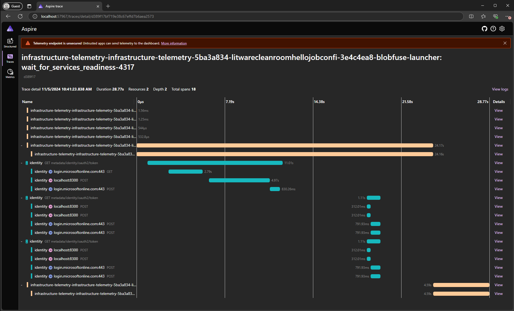

# Multi-party collaboration <!-- omit from toc -->

These samples demonstrate usage of a **_confidential clean room_** (**CCR**) for multi-party collaboration for the following scenarios:
- Confidential access of protected data. [Job] / [API]
- Confidential execution of audited queries on protected datasets using a standalone DB engine residing within the CCR. [Analytics]
- Confidential inference from sensitive data using a protected ML model. [Inference]
- Confidential fine tuning of a protected ML model on protected datasets. [Training]


# Table of Contents <!-- omit from toc -->
<!--
  DO NOT UPDATE THIS MANUALLY

  The TOC is managed using the "Markdown All in One" extension.
  Use the extension commands to auto-update the TOC and section numbers.
-->
- [Overview](#overview)
- [Samples environment (per collaborator)](#samples-environment-per-collaborator)
  - [Bringing up the environment](#bringing-up-the-environment)
  - [Initializing the environment](#initializing-the-environment)
- [\[TODO\] High level execution sequence](#todo-high-level-execution-sequence)
- [Setup the consortium](#setup-the-consortium)
  - [Member identity creation (litware, fabrikam, contosso)](#member-identity-creation-litware-fabrikam-contosso)
  - [Create the CCF instance (operator)](#create-the-ccf-instance-operator)
  - [Invite members to the consortium (operator)](#invite-members-to-the-consortium-operator)
  - [Join the consortium (litware, fabrikam, contosso)](#join-the-consortium-litware-fabrikam-contosso)
- [Protect data shared for collaboration](#protect-data-shared-for-collaboration)
  - [KEK-DEK based encryption approach](#kek-dek-based-encryption-approach)
  - [Encrypt and upload data](#encrypt-and-upload-data)
- [Publisher: Setting up log collection](#publisher-setting-up-log-collection)
- [Share publisher clean room configuration with consumer](#share-publisher-clean-room-configuration-with-consumer)
- [Consumer: Output preparation and application configuration](#consumer-output-preparation-and-application-configuration)
  - [Application configuration and mount points](#application-configuration-and-mount-points)
    - [Mounting storage containers using Blobfuse2](#mounting-storage-containers-using-blobfuse2)
- [Proposing a governance contract](#proposing-a-governance-contract)
- [Agreeing upon the contract](#agreeing-upon-the-contract)
  - [Agree as publisher](#agree-as-publisher)
- [Propose ARM template, CCE policy and log collection](#propose-arm-template-cce-policy-and-log-collection)
- [Accept ARM template, CCE policy and logging proposals](#accept-arm-template-cce-policy-and-logging-proposals)
  - [Verify and accept as publisher](#verify-and-accept-as-publisher)
- [Setup access for the clean room](#setup-access-for-the-clean-room)
  - [Setup access as publisher](#setup-access-as-publisher)
  - [Setup access as consumer](#setup-access-as-consumer)
- [Deploy clean room](#deploy-clean-room)
- [Download encrypted output](#download-encrypted-output)
- [Download and share logs](#download-and-share-logs)
  - [Explore the downloaded logs](#explore-the-downloaded-logs)
  - [View telemetry for infrastucture containers](#view-telemetry-for-infrastucture-containers)
  - [See audit events](#see-audit-events)
- [Next Steps](#next-steps)
  - [Contributing](#contributing)
  - [Trademarks](#trademarks)

# Overview
All the scenarios demonstrate collaborations where one or more of the following parties come together:
  - **_Litware_**, end to end solution developer publishing applications that execute within the CCR.
  - **_Fabrikam_**, collaborator owning sensitive dataset(s) and protected AI model(s) that can be consumed by applications inside a CCR.
  - **_Contosso_**, collaborator owning sensitive dataset(s) that can be consumed by applications inside a CCR.
  
The following parties are additionally involved in completing the end to end scenario:
  - **_Client_**, consumer invoking the CCR endpoint to gather insights, without any access to the protected data itself.
  - **_Operator_**, clean room provider hosting the CCR infrastructure.

In all cases, a CCR will be executed to run the application while protecting the privacy of all ingested data, as well as protecting any confidential output. The CCR instance can be deployed by the operator, any of the collaborators or even the client without any impact on the zero-trust promise architecture.

<!-- TODO: We need to figure out how to capture this better as "capabilities" is an odd name for showcasing features. Maybe a features demonstrated table? -->
<!-- Capabilities demonstrated:
- How to encrypt and publish sensitve data such that it can be decrypted only within a CCR
- How to encrypt and output sensitive data from within the CCR such that it can only read by intended party
- How to exchange information about the published (encrypted) data and the clean room application between the collaborating parties
- How to create a governance contract capturing the application to be executed in the clean room and the data to be made available to it
- How to agree upon ARM templates and confidential computation security policy (CCE) that will be used for deploying the CCR
- How to enable collection of CCR execution logs and inspect the same in a confidential manner -->

# Samples environment (per collaborator)
All the involved parties need to bring up a local environment to participate in the sample collaborations.

## Bringing up the environment
> [!NOTE] Prerequisites to bring up the environment
> * Docker installed locally. Installation instructions [here](https://docs.docker.com/engine/install/).
> * Powershell installed locally. Installation instructions [here](https://learn.microsoft.com/en-us/powershell/scripting/install/installing-powershell).

```powershell
# Launch a pre-built docker container to create an environment in the context of one of the parties.
$memberName = "<persona>" # ("litware", "fabrikam", "contosso", "client", "operator")
./start-environment.ps1 -memberName $memberName
```

<br>
<details><summary><em>Executing the configuration steps manually</em></summary>
<br>

  We recommend running the following steps in PowerShell on WSL using Ubuntu 22.04.
  - Instructions for setting up WSL can be found [here](https://learn.microsoft.com/en-us/windows/wsl/install).
  - To install PowerShell on WSL, follow the instructions [here](https://learn.microsoft.com/en-us/powershell/scripting/install/install-ubuntu?view=powershell-7.3).

  To set the samples environment up, we will need the following tools to be installed prior to running the setup scripts.
  1. Azure CLI version >= 2.57. Installation instructions [here](https://learn.microsoft.com/en-us/cli/azure/install-azure-cli-linux).
  1. You need Docker for Linux installed locally. Installation instructions [here](https://docs.docker.com/engine/installation/#supported-platforms).
  1. Confidential containers Azure CLI extension, version >= 0.3.5. You can install this extension using ```az extension add --name confcom -y```. You can check the version of the extension using ```az extension show --name confcom```. Learn about it [here](https://learn.microsoft.com/en-us/cli/azure/confcom?view=azure-cli-latest).
  1. Managed CCF Azure CLI extension. You can install this extension using ```az extension add --name managedccfs -y```.
  1. azcopy versions >= 10.25.0. Installation instructions [here](https://learn.microsoft.com/en-us/azure/storage/common/storage-use-azcopy-v10).
  1. openssl - Download instructions for Linux [here](https://www.openssl.org/source/).
  1. jq - Download / install instructions for Linux [here](https://jqlang.github.io/jq/download/).
  1. Add the CleanRoom Azure CLI extension using:
      ```powershell
      az extension add --source https://cleanroomazcli.blob.core.windows.net/azcli/cleanroom-0.0.3-py2.py3-none-any.whl -y --allow-preview true
      ```
  1. Set the environment variable "MEMBER_NAME" to one of the following parties - "litware", "fabrikam", "contosso", "client", "operator"
  1. Set the environment variable "RESOURCE_GROUP" to the name of Azure Resource Group to be used for creating resources.

</details>
<br>

## Initializing the environment
> [!NOTE] Prerequisites to initialize the environment
> * An Azure subscription with adequate permissions to create resources and manage permissions on these resources.

Once the environment is setup, initialize it for executing the samples by executing the following command from the `/home/samples` directory:

```powershell
# Login to Azure. If required, set the subscription.
az login

# Create the resource group and other Azure resources required for executing the samples.
./scripts/initialize-environment.ps1
```

> [!IMPORTANT]
> All the steps henceforth assume that you are working in the `/home/samples` directory of the docker container, and commands are executed relative to that path.

# [TODO] High level execution sequence
Before we begin below gives the overall flow of execution that happens in this sample. It gives a high level perspective that might be helpful to keep in mind as you run through the steps.

<br>
Once the clean room is deployed the key components involved during execution are shown below:


# Setup the consortium
Collaboration using a CCR is realized and governed through a consortium created in [CCF](https://microsoft.github.io/CCF/main/overview/what_is_ccf.html) hosting a [Clean Room Governance Service (CGS)](../../src/governance/README.md). All the collaborating parties become participating members in the consortium.

From a confidentiality perspective any of the collaborators or the operator can create the CCF instance without affecting the zero-trust assurances. In these samples, we assume that it was agreed upon that the operator will host the CCF instance. The operator would create the CCF instance and then invite all the collaborators as members into the consortium.


## Member identity creation (litware, fabrikam, contosso)
A CCF member is identified by a public-key certificate used for client authentication and command signing. Each member of the collaboration creates their member identity by generating their public and private key pair.

```powershell
./scripts/initialize-member.ps1
```

Above command shows output similar to below.

```
-- Generating identity private key and certificate for participant "contosso"...
Identity curve: secp384r1
Identity private key generated at:   ./demo-resources.secret/contosso_privk.pem
Identity certificate generated at:   ./demo-resources.secret/contosso_cert.pem (to be registered in CCF)
-- Generating RSA encryption key pair for participant "contosso"...
writing RSA key
Encryption private key generated at:  ./demo-resources.secret/contosso_enc_privk.pem
Encryption public key generated at:   ./demo-resources.secret/contosso_enc_pubk.pem (to be registered in CCF)
```

The above command will generate the public/private key pair. The member’s identity private key should be stored on a trusted device (e.g. HSM) and kept private (not shared with any other member) while the certificate (e.g. membername_cert.pem) would be registered in CCF (later in the flow).


## Create the CCF instance (operator)

Run the below steps to create the CCF instance.
```powershell
./scripts/create-consortium.ps1
```

## Invite members to the consortium (operator)
For each member of the collaboration, the operator (who is hosting the CCF instance) needs to run the below commands:

```powershell
./scripts/register-member.ps1
```

## Join the consortium (litware, fabrikam, contosso)
Once the collaborators have been added, they now need to activate their membership before they can participate in the collaboration. The operator must share the `ccfEndpoint` value to the collaborators so they can know which CCF instance to connect to.

```powershell
./scripts/confirm-member.ps1
```
With the above steps the consortium creation that drives the creation and execution of the clean room is complete. We now proceed to preparing the datasets and making them available in the clean room.

> [!NOTE]
> The same consortium can be used/reused for executing any/all the sample scenarios. There is no need to repeat these steps unless the collaborators have changed. 

# Protect data shared for collaboration
Sensitive data that any of the parties want to bring into the collaboration needs to be encrypted in a manner that ensures the key to decrypt this data will only be released to the clean room environment. 

## KEK-DEK based encryption approach
The samples follow an envelope encryption model for encryption of data. For the encryption of the data, a symmetric **_Data Encryption Key_** (**DEK**) is generated. An asymmetric key, called the *Key Encryption Key* (KEK), is generated subsequently to wrap the DEK. The wrapped DEKs are stored in a Key Vault as a secret and the KEK is imported into an MHSM/Premium Key Vault behind a secure key release (SKR) policy. Within the clean room, the wrapped DEK is read from the Key Vault and the KEK is retrieved from the MHSM/Premium Key Vault following the [secure key release](https://learn.microsoft.com/en-us/azure/confidential-computing/concept-skr-attestation) protocol. The DEKs are unwrapped within the cleanroom and then used to access the storage containers.

The parties can choose between a Managed HSM or a Premium Azure Key Vault for storing their encryption keys passing the `-kvType` paramter to the scripts below.

## Encrypt and upload data
It is assumed that the publisher and consumer have had out-of-band communication and have agreed on the data sets that will be shared. In these samples it is assumed that the protected data is in the form of one or more files in one or more folders at the publisher's and consumer's end.

The setup involves creating an Azure resource group into which a storage account and a Managed HSM or Premium Key Vault are deployed. The dataset(s) in the form of files are encrypted (using the KEK-DEK approach mentioned earlier) and uploaded into the the storage account. Each folder in the source dataset would correspond to one storage container, and all files in that folder are [uploaded as blobs to Azure Storage using Customer Provided Keys](https://learn.microsoft.com/azure/storage/blobs/encryption-customer-provided-keys). The sample creates one symmetric key per folder (storage container).


Publish datasets for running the demo by executing the following command from the `/home/samples` directory. This initializes datastores and uploads encrypted datasets required for executing the samples:
```powershell
$scenario = "analytics"

# Publish data. 
#
# Data publisher persona is picked from $env:MEMBER_NAME by default, use -persona to override.
# Storage account is picked from ./demo-resources.private/$env:RESOURCE_GROUP.generated.json by default, use -sa to override.
#
./demos/$scenario/publish-data.ps1
```

```powershell
$configResult = (./scripts/init-config.ps1 -scenario $scenario)
```
The above command creates the file with the below content:
```
identities: []
specification:
  applications: []
  datasinks: []
  datasources: []
  telemetry: {}

```

In the `publisher-demo` directory enter the below to create a storage account, add the dataset `publisher-input` as a datasource and then encrypt and upload files into Azure storage. If your scenario has multiple datasets/folders that need to be encrypted and uploaded then repeat the `add-datasource` and `upload` commands for every folder.
```powershell
./demos/$scenario/add-config-data.ps1 -persona $env:MEMBER_NAME
```

The above steps captures the information related to the datasets provided, their URLs in the storage accounts and encryption key information in the `publisher-config` file. This file would be exported later and shared with the consumer to let them know the datsources the publisher is sharing via the clean room.

> [!TIP]
> `add-datasource` step might fail with the below error in case the RBAC permissions on the storage account created by the `prepare-resources.ps1` has not been applied yet. Try the `add-datasource` command again after a while.
> 
> 

# Publisher: Setting up log collection
In this collabration say the consumer wants to inspect both the infrastructure and application logs once clean room finishes execution. But the publisher has a concern that sensitive information might leak out via logs and hence wants to inspect the log files before the consumer gets them. This can be achieved by using a storage account that is under the control of the publisher as the destination for the execution logs. These log files will be encrypted and written out to Azure storage with a key that is in the publisher's control. The publisher can then download and decrypt these logs, inspect them and if satisfied can share these with the consumer.

The below step configures the storage account endpoint details for collecting the application logs. Actual download of the logs happens later on.
```powershell
# $result below refers to the output of the prepare-resources.ps1 that was run earlier.
./scripts/config-telemetry.ps1 -scenario $scenario
```

# Share publisher clean room configuration with consumer
For the consumer to configure their application to access the data from the publisher it needs to know the details about the datasources that have been prepared by the publisher. Eg the consumer needs to refer to the individual datasources by their name when specifying where to mount each datasource in the container. The publisher needs to share the `publisher-config` file with the consumer.

```powershell
$privateFolder = "./demo-resources.private"
$publicFolder = "./demo-resources.public"
$scenario = "analytics"

$memberConfig = $privateFolder + "/$env:RESOURCE_GROUP-$scenario.config"
cp $memberConfig "$publicFolder/$env:MEMBER_NAME-$scenario.config"
```

# Consumer: Output preparation and application configuration
## Application configuration and mount points
The application details such as the app name, container registry, image ID, command, environment variables and resources needs to be captured as below. Replace the values for the parameters as appropriate.

The sample application is located at `consumer-demo/application` directory. It is a `golang` application that reads a text file from `INPUT_LOCATION`, compresses it and writes the archive out to `OUTPUT_LOCATION`. The below command adds the application details to the configuration file.
```powershell
az cleanroom config init --cleanroom-config ./demo-resources.private/analysis.config

./demos/analytics/add-config-application.ps1 -cleanroom_config_file ./demo-resources.private/analysis.config

```
For demo purposes this sample uses the `golang` container image to compile and run code from within the container image itself. In a real world scenario the container image would be the consumer's application and not the `golang` image.

### Mounting storage containers using Blobfuse2
The `--mounts` flag allows you to mount a datasource or datasink in a container. `--mount` consists of multiple key-value pairs, separated by commas and each consisting of a `key=value` tuple.
- `src`: The source of the mount. This is the `name` of a `datasource` or `datasink` that needs to be mounted. Eg in this sample `publisher-input` is the datasource name present in `publisher-config` while `consumer-output` is the datasink name present in `consumer-config`.
- `dst`: The destination takes as its value the path where the datasource/datasink gets mounted in the container.

During clean room execution each of the `src` mounts that are mentioned above get exposed transparently as file system mount points using [Azure Storage Blosefuse2](https://github.com/Azure/azure-storage-fuse/tree/main?tab=readme-ov-file#about) driver. The application container reads clear text data and writes clear text data to/from the `src` mountpoint(s) and does not need to deal with any encryption/decryption semantics. The blob fuse driver transparently decrypts (for application reads) and encrypts (for application writes) using the [DEK](#61-kek-dek-based-encryption-approach) that gets released during clean room execution.

The resources for the application container should be allocated so as not to violate confidential ACI limits as defined [here](https://learn.microsoft.com/en-us/azure/container-instances/container-instances-resource-and-quota-limits#confidential-container-resources-preview).

# Proposing a governance contract
Once the two parties are finished with above steps we have the following artifacts generated:
- `publisher-config` document at the publisher's end and shared with the consumer.
- `consumer-config` document at the consumer's end

The above documents captures various details that both parties need to exchange and agree upon before the clean room can be created and deployed. This exchange and agreement is captured formally by creation of a *governance contract* hosted in CCF which would contain the *clean room specification*. The clean room specification is a YAML document that is generated using these two documents and captures the collaboration details in a [formal specification](../../docs/cleanroomspec.md).

The contract creation and proposal can be initiated by either of the 2 parties without affecting zero-trust assurances. In our sample we assume the consumer takes the responsibility of making the proposal.


The above sequence of steps are performed by the commands below:
```powershell
# Generate the cleanroom config which contains all the datasources, sinks and applications that are
# configured by both the producer and consumer.
az cleanroom config view `
    --cleanroom-config ./demo-resources.private/analysis.config `
    --configs ./demo-resources.public/fabrikam-analysis.config ./demo-resources.public/contosso-analysis.config `
    > ./demo-resources.public/analysis.cleanroom.config

# Validate the contract structure before proposing.
az cleanroom config validate --cleanroom-config ./demo-resources.public/analysis.cleanroom.config

$contractId = "collab1" # A unique identifier to refer to this collaboration.
$data = Get-Content -Raw ./demo-resources.public/analysis.cleanroom.config
az cleanroom governance contract create `
    --data "$data" `
    --id $contractId `
    --governance-client "$env:MEMBER_NAME-client"

# Submitting a contract proposal.
$version = (az cleanroom governance contract show `
    --id $contractId `
    --query "version" `
    --output tsv `
    --governance-client "$env:MEMBER_NAME-client")

az cleanroom governance contract propose `
    --version $version `
    --id $contractId `
    --query "proposalId" `
    --output tsv `
    --governance-client "$env:MEMBER_NAME-client"
```
The above command creates a contract in the governance service with the clean room specification yaml as its contents. Next both the consumer and publisher inspect the proposed contract and accept after verification.

# Agreeing upon the contract
The publisher/client can now query CCF to get the proposed contract, run their validations and accept or reject the contract. To achieve this:

## Agree as publisher 
```powershell
$contract = (az cleanroom governance contract show `
    --id $contractId `
    --governance-client "$env:MEMBER_NAME-client" | ConvertFrom-Json)

# Inspect the contract details that is capturing the storage, application container and identity details.
$contract.data

# Accept it.
az cleanroom governance contract vote `
    --id $contractId `
    --proposal-id $contract.proposalId `
    --action accept `
    --governance-client "$env:MEMBER_NAME-client"
```

# Propose ARM template, CCE policy and log collection
Once the contract is accepted by both parties, the party deploying the clean room can now generate an [Azure Confidential Container Instance](https://learn.microsoft.com/azure/container-instances/container-instances-confidential-overview) ARM template along with the CCE policy. Once the ARM template is generated, the [Confidential Computing Enforcement (CCE) policy](https://learn.microsoft.com/en-us/azure/container-instances/container-instances-confidential-overview#confidential-computing-enforcement-policies) can be computed. The command below generates both the ARM template and CCE policy following the flow mentioned [here](https://learn.microsoft.com/azure/container-instances/container-instances-tutorial-deploy-confidential-containers-cce-arm). Run the following command:
```powershell
mkdir ./demo-resources.public/$contractId

az cleanroom governance deployment generate `
    --contract-id $contractId `
    --governance-client "$env:MEMBER_NAME-client" `
    --output-dir ./demo-resources.public/$contractId
```
> [!NOTE]
> The above command invokes `az confcom acipolicygen` and takes around 10-15 minutes to finish.

Once run, this creates the following files in the output directory specified above: 
 1. `cleanroom-arm-template.json`. This is the ARM template that can be deployed. This has the base64 encoded CCE policy embedded in it.
 2. `cleanroom-governance-policy.json`. This file contains the clean room policy which identifies this clean room when its under execution.

Now propose the template and policy along with also submitting a proposal for enabling log collection.

```powershell
az cleanroom governance deployment template propose `
    --template-file ./demo-resources.public/$contractId/cleanroom-arm-template.json `
    --contract-id $contractId `
    --governance-client "$env:MEMBER_NAME-client"

az cleanroom governance deployment policy propose `
    --policy-file ./demo-resources.public/$contractId/cleanroom-governance-policy.json `
    --contract-id $contractId `
    --governance-client "$env:MEMBER_NAME-client"

# Propose enabling log and telemetry collection during cleanroom execution.
az cleanroom governance contract runtime-option propose `
    --option logging `
    --action enable `
    --contract-id $contractId `
    --governance-client "$env:MEMBER_NAME-client"

az cleanroom governance contract runtime-option propose `
    --option telemetry `
    --action enable `
    --contract-id $contractId `
    --governance-client "$env:MEMBER_NAME-client"
```

The generated ARM template and CCE policy are raised as proposals in the governance service on the same contract that was accepted. The proposals can be inspected as follows:
```powershell
# Inspect the proposed deployment template.
$proposalId = az cleanroom governance deployment template show `
    --contract-id $contractId `
    --governance-client "$env:MEMBER_NAME-client" `
    --query "proposalIds[0]" `
    --output tsv

az cleanroom governance proposal show-actions `
    --proposal-id $proposalId `
    --query "actions[0].args.spec.data" `
    --governance-client "$env:MEMBER_NAME-client"

# Inspect the proposed cce policy.
$proposalId = az cleanroom governance deployment policy show `
    --contract-id $contractId `
    --governance-client "$env:MEMBER_NAME-client" `
    --query "proposalIds[0]" `
    --output tsv

az cleanroom governance proposal show-actions `
    --proposal-id $proposalId `
    --query "actions[0].args" `
    --governance-client "$env:MEMBER_NAME-client"
```

# Accept ARM template, CCE policy and logging proposals
Once the ARM template and CCE policy proposals are available, the remaining parties can validate and vote on these proposals. In this sample, we run a simple validation and accept the template and CCE policy.

## Verify and accept as publisher
Run the following as the publisher.
```powershell
./scripts/accept-deployment-proposals.ps1 -contractId $contractId
```

# Setup access for the clean room
Both the publisher and the consumer need to give access to the clean room so that the clean room environment can access resources in their respective tenants. To do this first the the DEKs that were created for dataset encryption are now wrapped using a KEK. The KEK is uploaded in Key Vault and configured with a secure key release (SKR) policy while the wrapped-DEK is saved as a secret in Key Vault.

Further the managed identities (created earlier as part of the dataset preparation) is given access to resources and then we create federated credentials on the managed identity. The federated credential allows the clean room to get the managed identity access token during execution.

The flow below is executed by both the publisher and the consumer in their respective Azure tenants.


## Setup access as publisher
Run the following as the publisher.
```powershell
# Creates a KEK with SKR policy, wraps DEKs with the KEK and put in kv.
az cleanroom config wrap-deks `
    --contract-id $contractId `
    --cleanroom-config $publisherConfig `
    --governance-client "publisher-client"

# Setup OIDC issuer and managed identity access to storage/KV in publisher tenant.
./setup-access.ps1 `
    -resourceGroup $publisherResourceGroup `
    -contractId $contractId  `
    -governanceClient "publisher-client"
```
> [!TIP]
> `setup-access` step might fail with the below error in case the RBAC permissions on the storage account created by the it has not been applied yet by the time its attempting to create a storage account. Try the command again after a while.
> 
> 

## Setup access as consumer
Run the following as the consumer.
```powershell
# Creates a KEK with SKR policy, wraps DEKs with the KEK and put in kv.
az cleanroom config wrap-deks `
    --contract-id $contractId `
    --cleanroom-config $consumerConfig `
    --governance-client "consumer-client"

# Setup OIDC issuer endpoint and managed identity access to storage/KV in consumer tenant.
./setup-access.ps1 `
    -resourceGroup $consumerResourceGroup `
    -contractId $contractId `
    -governanceClient "consumer-client"
```

# Deploy clean room
Once the ARM template and CCE policy proposals have been accepted and access has been configured, the party deploying the clean room (the consumer in our case) can do so by running the following:

```powershell
# Get the agreed upon ARM template for deployment.
(az cleanroom governance deployment template show `
    --contract-id $contractId `
    --governance-client "consumer-client" `
    --query "data") | Out-File "./demo-resources/aci-deployment-template.json"

# Deploy the clean room.
$cleanRoomName = "collab-cleanroom"
az deployment group create `
    --resource-group $consumerResourceGroup `
    --name $cleanRoomName `
    --template-file "./demo-resources/aci-deployment-template.json"
```
Run the following script to wait for the cleanroom to exit.
```powershell
./wait-for-cleanroom.ps1 -cleanRoomName $cleanRoomName -resourceGroup $consumerResourceGroup
```

Once execution completes the result is written out to `consumer-ouput` datasink as configured by the consumer.

# Download encrypted output
Post execution, the encrypted output is written out to the consumer's storage account. To decrypt and download this, run the following:
```powershell
az cleanroom datasink download `
    --cleanroom-config $consumerConfig `
    --name consumer-output `
    --target-folder "./consumer-demo/consumer-output"
```
This downloads the files from the storage container into the specified folder. There should be an `output.gz` file in the `consumer-demo/consumer-output` folder. Decompress the same via the below command and compare the contents of the decompressed file with that of `publisher-demo/publisher-input/input.txt`:
```powershell
gzip -d ./consumer-demo/consumer-output/consumer-output/output.gz
cat ./consumer-demo/consumer-output/consumer-output/output
```

# Download and share logs
The publisher can download the infrastructure telemetry and application logs. These are available post execution in an encrypted form. To decrypt and inspect, run the following:
```powershell
az cleanroom logs download `
    --cleanroom-config $publisherConfig `
    --target-folder "./publisher-demo/logs"

az cleanroom telemetry download `
    --cleanroom-config $publisherConfig `
    --target-folder "./publisher-demo/telemetry"
```
The above command will download into the specified target folder and decrypt the various files for metrics, traces and logs. The publisher can inspect these files and then choose to share them with the consumer.

## Explore the downloaded logs
See the logs emitted by the application container using the below command:
```powershell
cat ./publisher-demo/logs/application-telemetry/demo-app.log
```
This shows output as below:
```powershell
2024-06-05T12:54:17.945694635+00:00 stdout F File is present at: /mnt/remote/input/input.txt
2024-06-05T12:54:17.945694635+00:00 stdout F Opening the input file.
2024-06-05T12:54:17.953695222+00:00 stdout F Creating the output file.
2024-06-05T12:54:18.168096107+00:00 stdout F Compressing the file.
2024-06-05T12:54:18.169313592+00:00 stdout F File compressed successfully.
```
## View telemetry for infrastucture containers

You can also inspect the telemetry emitted by the clean room infrastructure containers as telemetry was enabled in this sample.

The infrastructure containers traces, logs and metrics that are useful for debugging errors, tracing the execution sequence etc.

To view the telemetry, run the following command:

```powershell
az cleanroom telemetry aspire-dashboard `
    --telemetry-folder ./publisher-demo/telemetry/infrastructure-telemetry
```

The telemetry dashboard uses [.NET Aspire Dashboard](https://learn.microsoft.com/en-us/dotnet/aspire/fundamentals/dashboard/standalone?tabs=bash) to display the traces, logs and metrics that are generated. This spins up a set of docker containers with the aspire dashboard to visualize the telemetry.

There are different views that are available:
1. Traces: Track requests and activities across all the sidecars so that we can see where time is spent and track down specific failures.
2. Logs: Record individual operations in the context of one of the request / activity.
3. Metrics: Measure counters and gauges such as successful requests, failed requests, latency etc.

### Traces view: <!-- omit from toc -->


### Broken down trace view: <!-- omit from toc -->



### Logs view: <!-- omit from toc -->


## See audit events
Either publisher or the consumer can also check for any audit events raised by the clean room during its execution for the contract by running the command below. Below instance runs the command as the `publisher-client`:
```powershell
az cleanroom governance contract event list `
    --contract-id $contractId `
    --all `
    --governance-client "publisher-client"
```
This shows output as below:
```json
{
  "value": [
    {
      "data": {
        "message": "starting execution of demo-app container",
        "source": "code-launcher"
      },
      "id": "collab1",
      "scope": "",
      "seqno": 100,
      "timestamp": "1717591984758",
      "timestamp_iso": "2024-06-05T12:53:04.758Z"
    },
    {
      "data": {
        "message": "demo-app container terminated with exit code 0",
        "source": "code-launcher"
      },
      "id": "collab1",
      "scope": "",
      "seqno": 102,
      "timestamp": "1717592058947",
      "timestamp_iso": "2024-06-05T12:54:18.947Z"
    }
  ]
}
```
# Next Steps
- See how to [perform a code change](./scenarios/code-change/README.md) for the application container and redeploy a new clean room instance.
- See how to [perform upgrades](./scenarios/upgrade/README.md) of the cleanroom infrastructure components.


## Contributing

This project welcomes contributions and suggestions.  Most contributions require you to agree to a
Contributor License Agreement (CLA) declaring that you have the right to, and actually do, grant us
the rights to use your contribution. For details, visit https://cla.opensource.microsoft.com.

When you submit a pull request, a CLA bot will automatically determine whether you need to provide
a CLA and decorate the PR appropriately (e.g., status check, comment). Simply follow the instructions
provided by the bot. You will only need to do this once across all repos using our CLA.

This project has adopted the [Microsoft Open Source Code of Conduct](https://opensource.microsoft.com/codeofconduct/).
For more information see the [Code of Conduct FAQ](https://opensource.microsoft.com/codeofconduct/faq/) or
contact [opencode@microsoft.com](mailto:opencode@microsoft.com) with any additional questions or comments.

## Trademarks

This project may contain trademarks or logos for projects, products, or services. Authorized use of Microsoft 
trademarks or logos is subject to and must follow 
[Microsoft's Trademark & Brand Guidelines](https://www.microsoft.com/en-us/legal/intellectualproperty/trademarks/usage/general).
Use of Microsoft trademarks or logos in modified versions of this project must not cause confusion or imply Microsoft sponsorship.
Any use of third-party trademarks or logos are subject to those third-party's policies.
