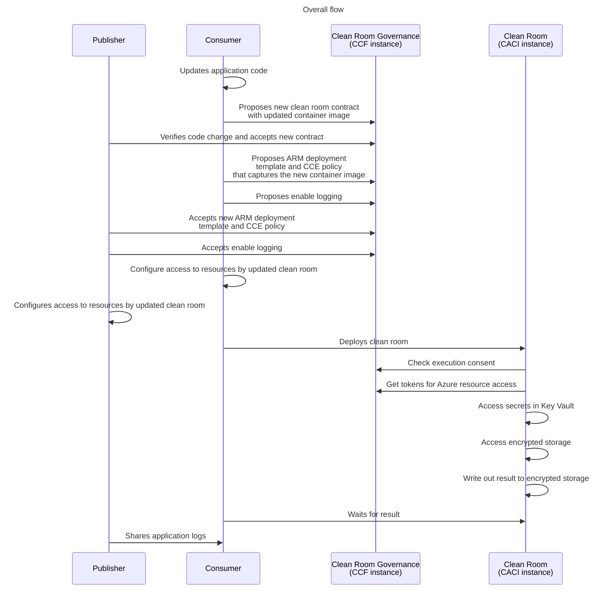

# Multi-party collaboration: Re-deploying after a code change <!-- omit from toc -->

- [1. Prerequisites](#1-prerequisites)
- [2. Scenarios demontstrated by this sample](#2-scenarios-demontstrated-by-this-sample)
- [3. High level execution sequence](#3-high-level-execution-sequence)
- [4. Consumer: Update the code and `add-application` section](#4-consumer-update-the-code-and-add-application-section)
- [5. Consumer: Propose new governance contract](#5-consumer-propose-new-governance-contract)
- [6. Agreeing upon the new contract](#6-agreeing-upon-the-new-contract)
- [7. Propose ARM template, CCE policy and log collection](#7-propose-arm-template-cce-policy-and-log-collection)
- [8. Accept ARM template, CCE policy and logging proposals](#8-accept-arm-template-cce-policy-and-logging-proposals)
- [9. Setup access for the updated clean room](#9-setup-access-for-the-updated-clean-room)
- [10. Deploy updated clean room](#10-deploy-updated-clean-room)
- [11. Download encrypted output and logs](#11-download-encrypted-output-and-logs)

# 1. Prerequisites
This guide assumes you have finished the [multi-party collaboration sample](../../README.md) steps successfully and builds upon that setup.

# 2. Scenarios demonstrated by this sample
This sample demonstrates the following capabilities:
- How to make a code change in the consumer application and redeploy the clean room
- Creation of a new contract to capture the updated clean room configuration
- How both parties must agree upon the new contract before a new instance of the updated clean room can get deployed

# 3. High level execution sequence
Before we begin below gives the overall flow of execution that happens in this sample. It gives a high level perspective that might be helpful to keep in mind as you run thru the steps.

# 4. Consumer: Update the code and `add-application` section
For the purposes of this demo a simple code change is made under `application/main-updated.go`.
In the directory named `scenarios/code-change` run the below to update application details to the existing `consumer-config` configuration file that had been created by the consumer (as part of running the main sample scenario):
```powershell
# Below config file got created before (as part of running the main sample scenrio successfully)
$consumerConfig = "./consumer-demo/consumer-config"

# New Go code is being loaded into the CODE environment variable which will result in a CCE policy change.
$sample_code = $(cat application/main-updated.go | base64 -w 0)

# Update the application entry with the new configuration.
az cleanroom config add-application `
    --cleanroom-config $consumerConfig `
    --name demo-app `
    --image "docker.io/golang@sha256:f43c6f049f04cbbaeb28f0aad3eea15274a7d0a7899a617d0037aec48d7ab010" `
    --command "bash -c 'echo `$CODE | base64 -d > main-updated.go; go run main-updated.go'" `
    --mounts "src=publisher-input,dst=/mnt/remote/input" `
             "src=consumer-output,dst=/mnt/remote/output" `
    --env-vars OUTPUT_LOCATION=/mnt/remote/output `
               INPUT_LOCATION=/mnt/remote/input `
               CODE="$sample_code" `
    --cpu 0.5 `
    --memory 4
```
# 5. Consumer: Propose new governance contract
With the changed made into the `consumer-config` file the consumer must now create a new merged configuration and propose a new contract that is created out of the new merged configuration. The `publisher-config` that was shared by the publisher is reused as-is as there is no change in the clean room configuration from the publisher's end.

```powershell
# Re-use publisher-config as-is.
$publisherConfig = "./publisher-demo/publisher-config"

# Recreate a new clean room configuration that captures the updated application configuration.
az cleanroom config view --cleanroom-config $consumerConfig --configs $publisherConfig > ./demo-resources/merged-config-updated

 # Use a new unique identifier to refer to the updated collaboration.
$contractId = "collab1-update"
$data = Get-Content -Raw ./demo-resources/merged-config-updated
az cleanroom governance contract create --data "$data" --id $contractId --governance-client "consumer-client"

# Submitting a contract proposal.
$version=(az cleanroom governance contract show --id $contractId --query "version" --output tsv --governance-client "consumer-client")

az cleanroom governance contract propose --version $version --id $contractId --query "proposalId" --output tsv --governance-client "consumer-client"
```
The above command creates a new contract in the governance service with the clean room specification yaml as its contents. 

The remaining steps below are the same as that for the mainline multi-party collab scenario. The only difference being that these are performed for a `contractId` that captures the updated clean room specification.

# 6. Agreeing upon the new contract
 Follow [agreeing upon the contract](../../README.md#11-agreeing-upon-the-contract) with the change of `$contractId` value to `collab1-update` as used above.
 ```powershell
 $contractId = "collab1-update"
 # Follow steps in the mainline readme for this section.
 ```
# 7. Propose ARM template, CCE policy and log collection
Follow [Propose ARM template, CCE policy and log collection](../../README.md#12-propose-arm-template-cce-policy-and-log-collection) with the change of `$contractId` value to `collab1-update` as used above.
 ```powershell
 $contractId = "collab1-update"
 # Follow steps in the mainline readme for this section.
 ```
# 8. Accept ARM template, CCE policy and logging proposals
Follow [Accept ARM template, CCE policy and logging proposals](../../README.md#13-accept-arm-template-cce-policy-and-logging-proposals) with the change of `$contractId` value to `collab1-update` as used above.

# 9. Setup access for the updated clean room
Follow [Setup access for the clean room](../../README.md#14-setup-access-for-the-clean-room) with the change of `$contractId` value to `collab1-update` as used above.

# 10. Deploy updated clean room
Follow [Deploy clean room](../../README.md#15-deploy-clean-room) with the change of `$contractId` value to `collab1-update` as used above.

# 11. Download encrypted output and logs
Follow [Download encrypted output](../../README.md#16-download-encrypted-output) and [Download and share logs](../../README.md#17-download-and-share-logs) with the change of `$contractId` value to `collab1-update` as used above.
