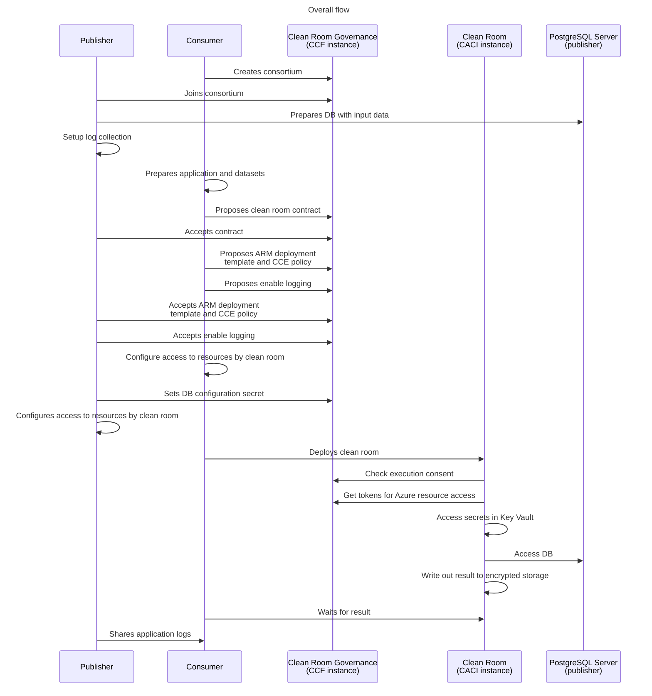
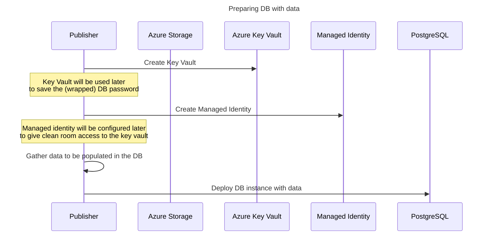
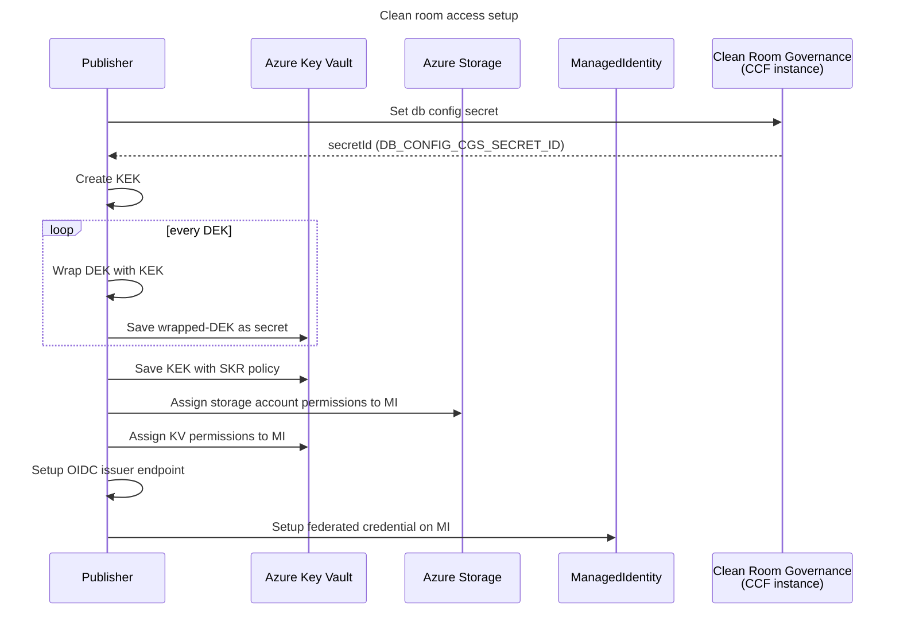

# Multi-party collaboration: Sharing data from a DB <!-- omit from toc -->

- [1. Prerequisites](#1-prerequisites)
- [2. Scenarios demonstrated by this sample](#2-scenarios-demonstrated-by-this-sample)
- [3. High level execution sequence](#3-high-level-execution-sequence)
- [4. Setup the consortium](#4-setup-the-consortium)
- [5. Publisher: Preparing DB with inputs](#5-publisher-preparing-db-with-inputs)
  - [5.1. Protecting DB secrets](#51-protecting-db-secrets)
  - [5.2. Create DB and insert data](#52-create-db-and-insert-data)
- [6. Publisher: Setting up log collection](#6-publisher-setting-up-log-collection)
- [7. Consumer: Output preparation and application configuration](#7-consumer-output-preparation-and-application-configuration)
  - [7.1. Preparing datasink to receive output](#71-preparing-datasink-to-receive-output)
  - [7.2. Application configuration, DB access and mount points](#72-application-configuration-db-access-and-mount-points)
    - [7.2.1. Specifying DB configuration secret](#721-specifying-db-configuration-secret)
    - [7.2.2. Mounting storage containers using Blobfuse2](#722-mounting-storage-containers-using-blobfuse2)
- [8. Consumer: Propose governance contract](#8-consumer-propose-governance-contract)
- [9. Agreeing upon the contract](#9-agreeing-upon-the-contract)
- [10. Propose ARM template, CCE policy and log collection](#10-propose-arm-template-cce-policy-and-log-collection)
- [11. Accept ARM template, CCE policy and logging proposals](#11-accept-arm-template-cce-policy-and-logging-proposals)
- [12. Setup access for the clean room](#12-setup-access-for-the-clean-room)
  - [12.1. Setup access as publisher](#121-setup-access-as-publisher)
  - [12.2. Setup access as consumer](#122-setup-access-as-consumer)
- [13. Deploy clean room](#13-deploy-clean-room)
- [14. Download encrypted output and logs](#14-download-encrypted-output-and-logs)
- [15. Next Steps](#15-next-steps)

# 1. Prerequisites
This guide assumes you have finished the prerequisite steps in the previous sample [multi-party collaboration sample prerequisites](../../README.md#3-prerequisites) successfully.

# 2. Scenarios demonstrated by this sample
This sample demonstrates the following capabilities:
- How a publisher can bring its data into the collaboration via a database hosted outside the cleanroom, instead of having the [datasets prepared as encrypted files](../../README.md#6-publisher-preparing-encrypted-dataset) on Azure blob storage as per the main sample.
- How to access the DB such as PostgreSQL as the data source from within the clean room.
- How to configure details such as the DB endpoint and password to be accessible from only within the clean room.
- How to write a sample application that run in the clean room and fetches the DB endpoint/password details for its business logic.
- How to write the result of the DB processing logic to encrypted storage.

This sample uses [PostgreSQL](https://www.postgresql.org/) to demonstrate the approach which can then be customized for real world scenarios.

# 3. High level execution sequence
Before we begin below gives the overall flow of execution that happens in this sample. It gives a high level perspective that might be helpful to keep in mind as you run thru the steps.


Once the clean room is deployed the key components involved during execution are shown below:


# 4. Setup the consortium
Follow the steps to [create a consortium](../../README.md#5-setup-the-consortium) as in the main 
sample. You can reuse the consortium if it was setup already.
 
# 5. Publisher: Preparing DB with inputs

## 5.1. Protecting DB secrets
This sample will have the publisher persona deploy a PostgreSQL server in Azure. To limit access to 
the DB only by the clean room the publisher will treat sensitive information like the DB username, password,
database name and endpoint details as secrets which will be encrypted such that only the clean room
can get access to the encryption key. These details will not be shared to the
consumer via any channel outside of the clean room.

A point to note here is that as compared to the encrypted storage sample where in the actual data was 
encrypted with keys that were released only to the clean room, here the data itself is not encrypted
in the DB.

The publisher has two ways of encrypting the DB configuration details:

- **Option 1:** Keep secrets in CGS (CCF) with a attestation report based release policy

- **Options 2:** Keep secrets in Azure Key Vault with an MAA token based SKR policy

This sample demonstrates both these options as follows. A configuration document with the below JSON schema will 
be created and saved as a secret in CGS (option 1) while the DB password will be saved in AKV with SKR (option 2).
### DB secret configuration document <!-- omit from toc -->
```json
// JSON document below gets saved as a secret in CGS (option 1)
{
  "dbEndpoint": "<...>",
  "dbName": "<...>",
  "dbUser": "<...>",
  "dbPassword": // Password is not set directly here but kept in AKV with SKR (option 2)
  {
    "clientId": "<...>",
    "tenantId": "<...>",
    "kid": "<password-kid>",
    "akvEndpoint": "https://vault1.vault.azure.net",
    "kek":
    {
      "kid": "<kek-kid>",
      "akvEndpoint": "https://vault2.vault.azure.net",
      "maaEndpoint": "https://sharedneu.neu.attest.azure.net"
    }
  }
}
```

The `dbPassword` section contains details that the code running in the clean room will use to perform SKR for the password.

The parties can choose between a Managed HSM or a Premium Azure Key Vault for storing their encryption keys passing the `-kvType` paramter to the scripts below.

## 5.2. Create DB and insert data
For demo purposes the PostgreSQL container image with some sample data will be deployed in Azure using Azure Container Instances (ACI). The ACI endpoint will be accessed from within the clean room. In a real world scenario the choice of the DB and its hosting platform would be different.

The setup involves creating an Azure resource group into which a storage account and a Managed HSM or Premium Key Vault are deployed. The storage account is used for log collection. The PostgreSQL ACI instance will also get deployed in the Azure resource group.


> [!NOTE]
> The steps henceforth assume that you are working in the `multi-party-collab` directory and all commands are executed relative to that.

In your `db-access/publisher-demo` directory in this sample, initialize a clean room configuration file named `publisher-db-config` with the below command:
```powershell
$publisherConfig = "./scenarios/db-access/publisher-demo/publisher-config"
az cleanroom config init --cleanroom-config $publisherConfig
```

Enter the below to create a KV, MI, storage account resources. This sample also deploys a PostgreSQL instance image that has some sample data. The DB container image is built from [Using Docker to Manage Your Test Database](https://github.com/TonicAI/docker-testdb) example (see the sample db schema, table and data details [here](https://github.com/TonicAI/docker-testdb/tree/main/postgres/sql)).
```powershell
$publisherResourceGroup = "publisher-$((New-Guid).ToString().Substring(0, 8))"

# Create storage account, KV and MI resources.
$pubResult = (./prepare-resources.ps1 -resourceGroup $publisherResourceGroup -kvType akvpremium)

# Create a KEK entry in the configuration.
az cleanroom config set-kek `
    --kek-key-vault $pubResult.kek.kv.id `
    --maa-url $pubResult.maa_endpoint `
    --cleanroom-config $publisherConfig

# Creates the PostgreSQL instance with sample data.
$db = ./scenarios/db-access/deploy-postgresql.ps1 -resourceGroup $publisherResourceGroup
```
As the DB will be accessed over the Internet (public network) the publisher needs to explicitly allow the consumer application code to have public network access. If this is not done then by default the clean room infrastructure disables all outbound network access for the application container.

> [!WARNING]
> Opening up the network connectivity for the application container increases the burden of establishing trust between the publisher and consumer. The publisher must ensure that the application code is audited by them and is performing actions in line with the agreement between the parties. The platform can't provide exfiltration guarantees.

```powershell
# Open up the network access to the application container.
az cleanroom config disable-sandbox `
    --cleanroom-config $publisherConfig
```

The consumer will also need to know from the publisher  the name of the secret in CGS that will have the DB configuration document. The secret gets inserted later on but the Id of the secret needs to be shared beforehand. The Id of the secret follows the convention `$memberId-<secretname>`. So when adding a secret called `dbconfig` later in the sample its id will be `$memberId-dbconfig`.
```powershell
$memberId = (az cleanroom governance client show `
  --name "publisher-client" `
  --query "memberId" `
  --output tsv)

$DB_CONFIG_CGS_SECRET_NAME = "dbconfig"
$DB_CONFIG_CGS_SECRET_ID = "${memberId}:DB_CONFIG_CGS_SECRET_NAME"
```

This `publisher-config` file would be exported later and shared with the consumer to help them create the final clean room configuration.

# 6. Publisher: Setting up log collection
Follow the steps to [setup log collection](../../README.md#7-publisher-setting-up-log-collection) as in the main 
sample. Note: use the results variable name '$pubResult' from the prepare step above while executing the cmds.

# 7. Consumer: Output preparation and application configuration
## 7.1. Preparing datasink to receive output
In your `db-access/consumer-demo` directory in this sample, initialize a clean room configuration file named `consumer-config` with the below command:
```powershell
$consumerConfig = "./scenarios/db-access/consumer-demo/consumer-config"
az cleanroom config init --cleanroom-config $consumerConfig
```
In the `consumer-demo` directory enter the below to prepare a datasink that will receive the encrypted output that is generated by the clean room and is meant for the consumer's consumption:
```powershell
$consumerResourceGroup = "consumer-$((New-Guid).ToString().Substring(0, 8))"

# Create storage account, KV and MI resources.
$conResult = (./prepare-resources.ps1 -resourceGroup $consumerResourceGroup -kvType akvpremium)

# Create a KEK entry in the configuration.
az cleanroom config set-kek `
    --kek-key-vault $conResult.kek.kv.id `
    --maa-url $conResult.maa_endpoint `
    --cleanroom-config $consumerConfig

# Create a datasink entry in the configuration.
az cleanroom config add-datasink `
    --cleanroom-config $consumerConfig `
    --name consumer-output `
    --storage-account $conResult.sa.id `
    --identity $conResult.mi.id `
    --dek-key-vault $conResult.dek.kv.id
```

The above steps prepares a storage account to receive the clean room output and captures the information related to the output like the storage account and encryption key information in the `consumer-config` file.

## 7.2. Application configuration, DB access and mount points
The application details such as the app name, container registry, image ID, command, environment variables and resources needs to be captured as below. Replace the values for the parameters as appropriate.

The sample application is located at `db-access/consumer-demo/application` directory. It is a `golang` application that does the following:
- Reads the DB configuration JSON document that is stored as a secret in CGS
- Performs SKR for the DB password from AKV
- Uses the retrieved DB details to connect to the DB and perform a query
- Writes out the result in a text file to `OUTPUT_LOCATION`

The application will run the following query against the sample DB and write out all the result rows:
```sql
SELECT id, first_name FROM users WHERE gender="Female"
```

The below command adds the application details to the configuration file.
```powershell
# $DB_CONFIG_CGS_SECRET_ID variable used below was set previously.
$sample_code = $(tar cz -C ./scenarios/db-access/consumer-demo application | base64 -w 0)
az cleanroom config add-application `
    --cleanroom-config $consumerConfig `
    --name demo-app `
    --image "docker.io/golang@sha256:f43c6f049f04cbbaeb28f0aad3eea15274a7d0a7899a617d0037aec48d7ab010" `
    --command "bash -c 'echo `$CODE | base64 -d | tar xz; cd application; go get; go run main.go'" `
    --mounts "src=consumer-output,dst=/mnt/remote/output" `
    --env-vars OUTPUT_LOCATION=/mnt/remote/output `
               DB_CONFIG_CGS_SECRET_ID=$DB_CONFIG_CGS_SECRET_ID `
               CODE="$sample_code" `
    --cpu 0.5 `
    --memory 4
```
For demo purposes this sample uses the `golang` container image to compile and run code from within the container image itself. In a real world scenario the container image would be the consumer's application and not the `golang` image.

### 7.2.1. Specifying DB configuration secret
In the above command `DB_CONFIG_CGS_SECRET_ID` is the name of the secret in CGS that the publisher will insert which will have the JSON configuration document [mentioned earlier](#db-secret-configuration-document). The consumer needs to know this name so that it can fetch the same from CGS.

### 7.2.2. Mounting storage containers using Blobfuse2
The `--mounts` flag allows you to mount a datasource or datasink in a container. In this sample only the datasink functionality is used. `--mount` consists of multiple key-value pairs, separated by commas and each consisting of a `key=value` tuple.
- `src`: The source of the mount. This is the `name` of the `datasink` that needs to be mounted. Eg in this sample `consumer-output` is the datasink name present in `consumer-config`.
- `dst`: The destination takes as its value the path where the datasink gets mounted in the container.

During clean room execution each of the `src` mounts that are mentioned above get exposed transparently as file system mount points using [Azure Storage Blosefuse2](https://github.com/Azure/azure-storage-fuse/tree/main?tab=readme-ov-file#about) driver. The application container writes clear text data to the `consumer-output` mountpoint and does not need to deal with any encryption/decryption semantics. The blob fuse driver transparently encrypts (for application writes) using the [DEK](../../README.md#61-kek-dek-based-encryption-approach) for the `datasink` that gets released during clean room execution.

The resources for the application container should be allocated so as not to violate confidential ACI limits as defined [here](https://learn.microsoft.com/en-us/azure/container-instances/container-instances-resource-and-quota-limits#confidential-container-resources-preview).

# 8. Consumer: Propose governance contract
Follow the steps to [propose a contract](../../README.md#10-proposing-a-governance-contract) as in the main 
sample with the change of `$contractId` value to `collab1-db`.

# 9. Agreeing upon the contract
 Follow [agreeing upon the contract](../../README.md#11-agreeing-upon-the-contract) as in the main 
sample.

# 10. Propose ARM template, CCE policy and log collection
Follow [Propose ARM template, CCE policy and log collection](../../README.md#12-propose-arm-template-cce-policy-and-log-collection) as in the main 
sample.

# 11. Accept ARM template, CCE policy and logging proposals
Follow [Accept ARM template, CCE policy and logging proposals](../../README.md#13-accept-arm-template-cce-policy-and-logging-proposals) as in the main 
sample.

# 12. Setup access for the clean room
Both the publisher and the consumer need to give access to the clean room so that the clean room environment can access resources in their respective tenants. The publisher sets the DB configuration document as a secret in CGS under the agreed upon contract. Next the DEKs that were created for logs (by the publisher) and output encryption (by the consumer) are now wrapped using a KEK. The KEK is uploaded in Key Vault and configured with a secure key release (SKR) policy while the wrapped-DEK is saved as a secret in Key Vault.

Further the managed identities (created earlier as part of the dataset preparation) is given access to resources and then we create federated credentials on the managed identity. The federated credential allows the clean room to get the managed identity access token during execution.

The flow below is executed by both the publisher and the consumer in their respective Azure tenants.
## 12.1. Setup access as publisher


Run the following as the publisher.

```powershell
# $db below refers to the output of deploy-postgresql.ps1. 
# wrap-secret keeps the DB password as a secret in AKV (option 2).
$passwordKid = "wrapped-db-password"
$wrapResult = (az cleanroom config wrap-secret `
    --name $passwordKid `
    --value $db.password `
    --secret-key-vault $pubResult.dek.kv.id `
    --contract-id $contractId `
    --cleanroom-config $publisherConfig `
    --governance-client "publisher-client" | ConvertFrom-Json)

# Get details about the MI that should be used to access the wrapped secret.
$identity = (az resource show --id $pubResult.mi.id --query properties | ConvertFrom-Json)

$secretConfig = @{
    dbEndpoint = $db.endpoint
    dbName     = $db.name
    dbUser     = $db.user
    dbPassword = @{
        clientId    = $identity.clientId
        tenantId    = $identity.tenantId
        kid         = $wrapResult.kid
        akvEndpoint = $wrapResult.akvEndpoint
        kek         = @{
            kid          = $wrapResult.kek.kid
            akvEndpoint = $wrapResult.kek.akvEndpoint
            maaEndpoint  = $pubResult.maa_endpoint
        }
    }
} | ConvertTo-Json | base64 -w 0

# Below keeps the DB configuration as a secret in CGS (option 1).
az cleanroom governance contract secret set `
  --secret-name db-config `
  --value $secretConfig `
  --contract-id $contractId `
  --governance-client "publisher-client"

# Creates a KEK with SKR policy, wraps DEKs with the KEK and put in kv.
az cleanroom config wrap-deks `
    --contract-id $contractId `
    --cleanroom-config $publisherConfig `
    --governance-client "publisher-client"

# Setup OIDC issuer and managed identity access to storage/KV in publisher tenant.
./setup-access.ps1 `
    -resourceGroup $publisherResourceGroup `
    -contractId $contractId  `
    -governanceClient "publisher-client"
```
> [!TIP]
> `setup-access` step might fail with the below error in case the RBAC permissions on the storage account created by the it has not been applied yet by the time its attempting to create a storage account. Try the command again after a while.
> 
> 

## 12.2. Setup access as consumer
Run the following as the consumer.
```powershell
# Creates a KEK with SKR policy, wraps DEKs with the KEK and put in kv.
az cleanroom config wrap-deks `
    --contract-id $contractId `
    --cleanroom-config $consumerConfig `
    --governance-client "consumer-client"

# Setup OIDC issuer endpoint and managed identity access to storage/KV in consumer tenant.
./setup-access.ps1 `
    -resourceGroup $consumerResourceGroup `
    -contractId $contractId `
    -governanceClient "consumer-client"
```


# 13. Deploy clean room
Follow [Deploy clean room](../../README.md#15-deploy-clean-room) as in the main sample.

# 14. Download encrypted output and logs
Post execution, the encrypted output is written out to the consumer's storage account. To decrypt and download this, run the following:
```powershell
az cleanroom datasink download `
    --cleanroom-config $consumerConfig `
    --name consumer-output `
    --target-folder "./scenarios/db-access/consumer-demo/consumer-output"
```
This downloads the files from the storage container into the specified folder. There should be an `output.txt` file in the `consumer-demo/consumer-output` folder:
```powershell
cat ./scenarios/db-access/consumer-demo/consumer-output/consumer-output/output.txt
```

To see the logs follow  [Download and share logs](../../README.md#17-download-and-share-logs).


# 15. Next Steps
- See how to [perform a code change](../code-change/README.md) for the application container and redeploy a new clean room instance.
- See how to [perform upgrades](../upgrade/README.md) of the cleanroom infrastructure components.