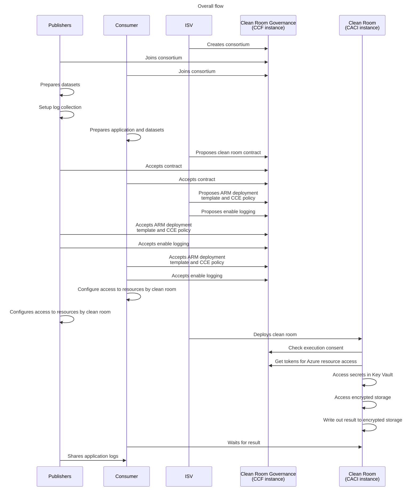

# Multi-party collaboration: ML Training <!-- omit from toc -->

- [1. Prerequisites](#1-prerequisites)
- [2. Scenarios demonstrated by this sample](#2-scenarios-demonstrated-by-this-sample)
- [3. High level execution sequence](#3-high-level-execution-sequence)
- [4. Setup the consortium](#4-setup-the-consortium)
  - [4.1. ISV member identity creation](#41-isv-member-identity-creation)
  - [4.2. Publisher member identity creation](#42-publisher-member-identity-creation)
  - [4.3. Consumer member identity creation](#43-consumer-member-identity-creation)
  - [4.4. Create the consortium](#44-create-the-consortium)
- [5. Publisher: Preparing encrypted datasets](#5-publisher-preparing-encrypted-datasets)
- [6. Publisher: Setting up log collection](#6-publisher-setting-up-log-collection)
- [7. Consumer: Input/output preparation and application configuration](#7-consumer-inputoutput-preparation-and-application-configuration)
  - [7.1. Prepare datasource for input model and config and datasink to receive output](#71-prepare-datasource-for-input-model-and-config-and-datasink-to-receive-output)
  - [7.2. Application configuration](#72-application-configuration)
- [8. ISV: Propose governance contract](#8-isv-propose-governance-contract)
- [9. Agreeing upon the contract](#9-agreeing-upon-the-contract)
  - [9.1. Agree as publisher](#91-agree-as-publisher)
  - [9.2. Agree as consumer](#92-agree-as-consumer)
- [10. ISV: Propose ARM template, CCE policy and log collection](#10-isv-propose-arm-template-cce-policy-and-log-collection)
- [11. Accept ARM template, CCE policy and logging proposals](#11-accept-arm-template-cce-policy-and-logging-proposals)
  - [11.1. Accept as publisher](#111-accept-as-publisher)
  - [11.2. Accept as consumer](#112-accept-as-consumer)
- [12. Setup access for the clean room](#12-setup-access-for-the-clean-room)
  - [12.1. Setup access as publisher](#121-setup-access-as-publisher)
  - [12.2. Setup access as consumer](#122-setup-access-as-consumer)
- [13. Deploy clean room](#13-deploy-clean-room)
- [14. Download encrypted output and logs](#14-download-encrypted-output-and-logs)

# 1. Prerequisites
This guide assumes you have finished the prerequisite steps in the previous sample [multi-party collaboration sample prerequisites](../../README.md#3-prerequisites) successfully.

# 2. Scenarios demonstrated by this sample
- This scenario is based on [DEPA Training](https://github.com/iSPIRT/depa-training/) and involves:
  - Three Training Data Providers (TDPs): ICMR, COWIN and a state war room that provide the datasets
  - A Training Data Consumer (TDC): who wishes to train or fine-tune a model using datasets from the TDPs
  - ISV: Hosts the confidential clean room infrastructure

# 3. High level execution sequence
Before we begin below gives the overall flow of execution that happens in this sample. It gives a high level perspective that might be helpful to keep in mind as you run thru the steps.


Once the clean room is deployed the key components involved during execution are shown below:


# 4. Setup the consortium
This collaboration between the publishers consumer and isv is realized by creating a 
[consortium in CCF](https://microsoft.github.io/CCF/main/overview/what_is_ccf.html) which runs a 
[clean room governance service](../../src/governance/README.md) where the publisher, consumer and 
isv become the participating members. Each CCF consortium member is identified by a public-key 
certificate used for client authentication and command signing. So first, the identity public and 
private key pairs for the new members needs be created.

> [!NOTE]
> The steps henceforth assume that you are working in the `multi-party-collab` directory and all commands are executed relative to that.

## 4.1. ISV member identity creation
```powershell
$certDir = "./scenarios/ml-training/demo-resources"

# Ensure you have openssl installed before running the command below.
az cleanroom governance member keygenerator-sh | bash -s -- --name "isv" --out $certDir
```
Above command shows output similar to below.
```powershell
-- Generating identity private key and certificate for participant "isv"...
Identity curve: secp384r1
Identity private key generated at:   ./scenarios/ml-training/demo-resources/isv_privk.pem
Identity certificate generated at:   ./scenarios/ml-training/demo-resources/isv_cert.pem (to be registered in CCF)
```
## 4.2. Publisher member identity creation
```powershell
# Ensure you have openssl installed before running the command below.
az cleanroom governance member keygenerator-sh | bash -s -- --name "tdp" --out $certDir
```
Above command shows output similar to below.
```powershell
-- Generating identity private key and certificate for participant "tdp"...
Identity curve: secp384r1
Identity private key generated at:   ./scenarios/ml-training/demo-resources/tdp_privk.pem
Identity certificate generated at:   ./scenarios/ml-training/demo-resources/tdp_cert.pem (to be registered in CCF)
```
## 4.3. Consumer member identity creation
```powershell
# Ensure you have openssl installed before running the command below.
az cleanroom governance member keygenerator-sh | bash -s -- --name "tdc" --out $certDir
```
Above command shows output similar to below.
```powershell
-- Generating identity private key and certificate for participant "tdc"...
Identity curve: secp384r1
Identity private key generated at:   ./scenarios/ml-training/demo-resources/tdc_privk.pem
Identity certificate generated at:   ./scenarios/ml-training/demo-resources/tdc_cert.pem (to be registered in CCF)
```

The above command will generate the public/private key pairs. The member’s identity private key 
should be stored on a trusted device (e.g. HSM) and kept private (not shared with any other member) 
while the certificate (e.g. member_name_cert.pem) would be registered in CCF (later in the flow).

## 4.4. Create the consortium
Steps below are a variation of the steps to [create a consortium](../../README.md#5-setup-the-consortium) as in the main 
sample.
### Create the CCF instance <!-- omit from toc -->
First ensure that you are logged into Azure and set the subscription (if required).
```powershell
# Login to Azure.
az login

# Set active subscription (optional).
az account set --subscription "<subname>"
```
Run the below steps to create the CCF instance.
```powershell
$isvResourceGroup = "isv-$((New-Guid).ToString().Substring(0, 8))"
az group create --name $isvResourceGroup --location westus

# Create the mCCF instance.
$ccfName = $isvResourceGroup + "-ccf"
$isvCert = "$certDir/isv_cert.pem" # Created previously via the keygenerator-sh command.
az confidentialledger managedccfs create `
    --name $ccfName `
    --resource-group $isvResourceGroup `
    --location "southcentralus" `
    --members "[{certificate:'$isvCert',identifier:'isv'}]"

$ccfEndpoint = (az confidentialledger managedccfs show `
    --resource-group $isvResourceGroup `
    --name $ccfName `
    --query "properties.appUri" `
    --output tsv)

# "isv" deploys client-side containers to interact with the governance service as the first member.
az cleanroom governance client deploy `
  --ccf-endpoint $ccfEndpoint `
  --signing-cert $certDir/isv_cert.pem `
  --signing-key $certDir/isv_privk.pem `
  --name "isv-client"

# Activate membership.
az cleanroom governance member activate --governance-client "isv-client"

# Deploy governance service on the CCF instance.
az cleanroom governance service deploy --governance-client "isv-client"
```

### Invite members into the consortium <!-- omit from toc -->
Once the CCF instance is created with the isv as the initial member the next step is to add the 
publisher and consumer into the consortium. For this the publisher and consumer needs to share their identity 
public key (`tdp_cert.pem`) and the Tenant Id with the consumer and then the isv 
(who is hosting the CCF instance) needs to run the below command:
```powershell
# In this demo both consumer and publisher are running in the same tenant as the isv. If they are coming from different Microsoft Entra ID tenant then use that value below.
$publisherTenantId = az account show --query "tenantId" --output tsv

# "isv" member makes a proposal for adding the new member "publisher".
$proposalId = (az cleanroom governance member add `
    --certificate $certDir/tdp_cert.pem `
    --identifier "tdp" `
    --tenant-id $publisherTenantId `
    --query "proposalId" `
    --output tsv `
    --governance-client "isv-client")

# Vote on the above proposal to accept the membership.
az cleanroom governance proposal vote `
  --proposal-id $proposalId `
  --action accept `
  --governance-client "isv-client"

$consumerTenantId = az account show --query "tenantId" --output tsv

# "isv" member makes a proposal for adding the new member "consumer".
$proposalId = (az cleanroom governance member add `
    --certificate $certDir/tdc_cert.pem `
    --identifier "tdc" `
    --tenant-id $consumerTenantId `
    --query "proposalId" `
    --output tsv `
    --governance-client "isv-client")

# Vote on the above proposal to accept the membership.
az cleanroom governance proposal vote `
  --proposal-id $proposalId `
  --action accept `
  --governance-client "isv-client"
```

Once the publisher and consumer have been added as members they both now needs t activate their 
membership before they can participate in the collaboration. The 
isv must share the `ccfEndpoint` value to the publisher and consumer so they can know which CCF 
instance to connect to.

```powershell
# "publisher" deploys client-side containers to interact with the governance service as the new member.
az cleanroom governance client deploy `
  --ccf-endpoint $ccfEndpoint `
  --signing-cert $certDir/tdp_cert.pem `
  --signing-key $certDir/tdp_privk.pem `
  --name "tdp-client"

# "publisher" accepts the invitation and becomes an active member in the consortium.
az cleanroom governance member activate --governance-client "tdp-client"

# "consumer" deploys client-side containers to interact with the governance service as the new member.
az cleanroom governance client deploy `
  --ccf-endpoint $ccfEndpoint `
  --signing-cert $certDir/tdc_cert.pem `
  --signing-key $certDir/tdc_privk.pem `
  --name "tdc-client"

# "consumer" accepts the invitation and becomes an active member in the consortium.
az cleanroom governance member activate --governance-client "tdc-client"

```
With the above steps the consortium creation that drives the creation and execution of the clean 
room is complete. We now proceed to preparing the datasets and making them available in the clean room.

# 5. Publisher: Preparing encrypted datasets
The steps below are the same as those explaining in 
[Preparing encrypted datasets](../../README.md#6-publisher-preparing-encrypted-datasets) as in the 
main sample. Please read that section for the KEK-DEK based approach that is used.

In your `publisher-demo` directory in this sample, initialize a clean room configuration file named `tdp-config` with the below command:
```powershell
$tdpConfig = "./scenarios/ml-training/publisher-demo/tdp-config"
az cleanroom config init --cleanroom-config $tdpConfig
```
The above command creates the file with the below content:
```
identities: []
specification:
  applications: []
  datasinks: []
  datasources: []
  telemetry: {}

```

In the `publisher-demo` directory enter the below to create a storage account, add the dataset `publisher-input` as a datasource and then encrypt and upload files into Azure storage. If your scenario has multiple datasets/folders that need to be encrypted and uploaded then repeat the `add-datasource` and `upload` commands for every folder.
```powershell
$tdpResourceGroup = "publisher-$((New-Guid).ToString().Substring(0, 8))"

# Create storage account, KV and MI resources.
$pubResult = (./prepare-resources.ps1 -resourceGroup $tdpResourceGroup -kvType akvpremium)

# Create a KEK entry in the configuration.
az cleanroom config set-kek `
    --kek-key-vault $pubResult.kek.kv.id `
    --maa-url $pubResult.maa_endpoint `
    --cleanroom-config $tdpConfig

# Create a datasource entry in the configuration.
$covidDataSamplePath = "./scenarios/ml-training/publisher-demo/publisher-input"
az cleanroom config add-datasource `
    --cleanroom-config $tdpConfig `
    --name cowin `
    --storage-account $pubResult.sa.id `
    --identity $pubResult.mi.id `
    --dek-key-vault $pubResult.dek.kv.id

# Encrypt and upload content.
az cleanroom datasource upload `
    --cleanroom-config $tdpConfig `
    --name cowin `
    --dataset-folder $covidDataSamplePath/cowin

az cleanroom config add-datasource `
    --cleanroom-config $tdpConfig `
    --name icmr `
    --storage-account $pubResult.sa.id `
    --identity $pubResult.mi.id `
    --dek-key-vault $pubResult.dek.kv.id

# Encrypt and upload content.
az cleanroom datasource upload `
    --cleanroom-config $tdpConfig `
    --name icmr `
    --dataset-folder $covidDataSamplePath/icmr

az cleanroom config add-datasource `
    --cleanroom-config $tdpConfig `
    --name index `
    --storage-account $pubResult.sa.id `
    --identity $pubResult.mi.id `
    --dek-key-vault $pubResult.dek.kv.id

# Encrypt and upload content.
az cleanroom datasource upload `
    --cleanroom-config $tdpConfig `
    --name index `
    --dataset-folder $covidDataSamplePath/index
```

The above steps captures the information related to the datasets provided, their URLs in the storage accounts and encryption key information in the `tdp-config` file. This file would be exported later and shared with the consumer to let them know the datsources the publisher is sharing via the clean room.

> [!TIP]
> `add-datasource` step might fail with the below error in case the RBAC permissions on the storage account created by the `prepare-resources.ps1` has not been applied yet. Try the `add-datasource` command again after a while.
> 
> 

# 6. Publisher: Setting up log collection
Steps below are adpated from [setup log collection](../../README.md#7-publisher-setting-up-log-collection) as in the main 
sample. Note: use the results variable name '$pubResult' from the prepare step above while executing the cmds.

```powershell
az cleanroom config set-logging `
    --cleanroom-config $tdpConfig `
    --storage-account $pubResult.sa.id `
    --identity $pubResult.mi.id `
    --dek-key-vault $pubResult.dek.kv.id

az cleanroom config set-telemetry `
    --cleanroom-config $tdpConfig `
    --storage-account $pubResult.sa.id `
    --identity $pubResult.mi.id `
    --dek-key-vault $pubResult.dek.kv.id
```
# 7. Consumer: Input/output preparation and application configuration
In your `ml-training/consumer-demo` directory in this sample, initialize a clean room configuration file named `tdc-config` with the below command:
```powershell
$tdcConfig = "./scenarios/ml-training/consumer-demo/tdc-config"
az cleanroom config init --cleanroom-config $tdcConfig
```
## 7.1. Prepare datasource for input model and config and datasink to receive output
In the `consumer-demo` directory enter the below to prepare datasources that will supply the input model and config and a datasink that will receive the encrypted model output that is generated by the clean room and is meant for the consumer's consumption:
```powershell
$tdcResourceGroup = "consumer-$((New-Guid).ToString().Substring(0, 8))"

# Create storage account, KV and MI resources.
$conResult = (./prepare-resources.ps1 -resourceGroup $tdcResourceGroup -kvType akvpremium)

az cleanroom config set-kek `
    --kek-key-vault $conResult.kek.kv.id `
    --maa-url $conResult.maa_endpoint `
    --cleanroom-config $tdcConfig

az cleanroom config add-datasource `
    --cleanroom-config $tdcConfig `
    --name model `
    --storage-account $conResult.sa.id `
    --identity $conResult.mi.id `
    --dek-key-vault $conResult.dek.kv.id

# Encrypt and upload content.
$tdcDataSamplePath = "./scenarios/ml-training/consumer-demo/consumer-input"
az cleanroom datasource upload `
    --cleanroom-config $tdcConfig `
    --name model `
    --dataset-folder $tdcDataSamplePath/model

az cleanroom config add-datasource `
    --cleanroom-config $tdcConfig `
    --name config `
    --storage-account $conResult.sa.id `
    --identity $conResult.mi.id `
    --dek-key-vault $conResult.dek.kv.id

# Encrypt and upload content.
az cleanroom datasource upload `
    --cleanroom-config $tdcConfig `
    --name config `
    --dataset-folder $tdcDataSamplePath/config

# Create a datasink entry in the configuration.
az cleanroom config add-datasink `
    --cleanroom-config $tdcConfig `
    --name output `
    --storage-account $conResult.sa.id `
    --identity $conResult.mi.id `
    --dek-key-vault $conResult.dek.kv.id

```

The above steps prepares a storage account with the clean room inputs/outputs and captures the 
information related to the output like the storage account and encryption key information in the 
`tdc-config` file.

## 7.2. Application configuration
The application details such as the app name, container registry, image ID, command, environment 
variables and resources needs to be captured as below. Replace the values for the parameters as 
appropriate.

The below command adds the application details to the configuration file.
```powershell
az cleanroom config add-application `
    --cleanroom-config $tdcConfig `
    --name depa-training `
    --image "cleanroomsamples.azurecr.io/depa-training@sha256:3a9b8d8d165bbc1867e23bba7b87d852025d96bd3cb2bb167a6cfc965134ba79" `
    --command "/bin/bash run.sh" `
    --mounts "src=config,dst=/mnt/remote/config" `
    "src=cowin,dst=/mnt/remote/cowin" `
    "src=icmr,dst=/mnt/remote/icmr" `
    "src=index,dst=/mnt/remote/index" `
    "src=model,dst=/mnt/remote/model" `
    "src=output,dst=/mnt/remote/output" `
    --env-vars model_config=/mnt/remote/config/model_config.json `
    query_config=/mnt/remote/config/query_config.json `
    --cpu 0.5 `
    --memory 4
```
The `cleanroomsamples.azurecr.io/depa-training` image above is a pre-built container image of the 
code that is available under the [consumer-input/application](./consumer-demo/consumer-input/application) folder.

### 7.2.1. Mounting storage containers using Blobfuse2 <!-- omit from toc -->
See [storage mounting](../../README.md#921-mounting-storage-containers-using-blobfuse2) section in the main sample to know more about the storage container mounting architecture.

The resources for the application container should be allocated so as not to violate confidential ACI limits as defined [here](https://learn.microsoft.com/en-us/azure/container-instances/container-instances-resource-and-quota-limits#confidential-container-resources-preview).

# 8. ISV: Propose governance contract
```powershell
$outDir = "./scenarios/ml-training/demo-resources"
$contractId = "collab1-ml"
az cleanroom config view `
    --cleanroom-config $tdcConfig `
    --configs $tdpConfig > $outDir/cleanroom-config

# Validate the contract structure before proposing.
az cleanroom config validate --cleanroom-config $outDir/cleanroom-config

# Submitting a contract proposal as isv.
$data = Get-Content -Raw $outDir/cleanroom-config
az cleanroom governance contract create `
    --data "$data" `
    --id $contractId `
    --governance-client "isv-client"

$version = (az cleanroom governance contract show `
        --id $contractId `
        --query "version" `
        --output tsv `
        --governance-client "isv-client")

az cleanroom governance contract propose `
    --version $version `
    --id $contractId `
    --governance-client "isv-client"

$contract = (az cleanroom governance contract show `
        --id $contractId `
        --governance-client "isv-client" | ConvertFrom-Json)

# Accept it as isv.
az cleanroom governance contract vote `
    --id $contractId `
    --proposal-id $contract.proposalId `
    --action accept `
    --governance-client "isv-client"
```
Follow the steps to [propose a contract](../../README.md#10-proposing-a-governance-contract) as in the main 
sample with the change of `$contractId` value to `collab1-db`.

# 9. Agreeing upon the contract
## 9.1. Agree as publisher
```powershell
az cleanroom governance contract vote `
    --id $contractId `
    --proposal-id $contract.proposalId `
    --action accept `
    --governance-client "tdp-client"
```
## 9.2. Agree as consumer
```powershell
az cleanroom governance contract vote `
    --id $contractId `
    --proposal-id $contract.proposalId `
    --action accept `
    --governance-client "tdc-client"
```

# 10. ISV: Propose ARM template, CCE policy and log collection
```powershell
mkdir -p $outDir/deployments
az cleanroom governance deployment generate `
    --contract-id $contractId `
    --governance-client "isv-client" `
    --output-dir $outDir/deployments

az cleanroom governance deployment template propose `
    --template-file $outDir/deployments/cleanroom-arm-template.json `
    --contract-id $contractId `
    --governance-client "isv-client"

az cleanroom governance deployment policy propose `
    --policy-file $outDir/deployments/cleanroom-governance-policy.json `
    --contract-id $contractId `
    --governance-client "isv-client"

# Propose enabling log and telemetry collection during cleanroom execution.
az cleanroom governance contract runtime-option propose `
    --option logging `
    --action enable `
    --contract-id $contractId `
    --governance-client "isv-client"

az cleanroom governance contract runtime-option propose `
    --option telemetry `
    --action enable `
    --contract-id $contractId `
    --governance-client "isv-client"

$clientName = "isv-client"
# Vote on the proposed deployment template.
$proposalId = az cleanroom governance deployment template show `
    --contract-id $contractId `
    --governance-client $clientName `
    --query "proposalIds[0]" `
    --output tsv
    
az cleanroom governance proposal vote `
    --proposal-id $proposalId `
    --action accept `
    --governance-client $clientName
    
# Vote on the proposed cce policy.
$proposalId = az cleanroom governance deployment policy show `
    --contract-id $contractId `
    --governance-client $clientName `
    --query "proposalIds[0]" `
    --output tsv
    
az cleanroom governance proposal vote `
    --proposal-id $proposalId `
    --action accept `
    --governance-client $clientName
    
# Vote on the enable logging proposal.
$proposalId = az cleanroom governance contract runtime-option get `
    --option logging `
    --contract-id $contractId `
    --governance-client $clientName `
    --query "proposalIds[0]" `
    --output tsv
    
az cleanroom governance proposal vote `
    --proposal-id $proposalId `
    --action accept `
    --governance-client $clientName
    
# Vote on the enable telemetry proposal.
$proposalId = az cleanroom governance contract runtime-option get `
    --option telemetry `
    --contract-id $contractId `
    --governance-client $clientName `
    --query "proposalIds[0]" `
    --output tsv
    
az cleanroom governance proposal vote `
    --proposal-id $proposalId `
    --action accept `
    --governance-client $clientName
```

# 11. Accept ARM template, CCE policy and logging proposals
## 11.1. Accept as publisher
```powershell
$clientName = "tdp-client"
# Vote on the proposed deployment template.
$proposalId = az cleanroom governance deployment template show `
    --contract-id $contractId `
    --governance-client $clientName `
    --query "proposalIds[0]" `
    --output tsv

az cleanroom governance proposal vote `
    --proposal-id $proposalId `
    --action accept `
    --governance-client $clientName

# Vote on the proposed cce policy.
$proposalId = az cleanroom governance deployment policy show `
    --contract-id $contractId `
    --governance-client $clientName `
    --query "proposalIds[0]" `
    --output tsv

az cleanroom governance proposal vote `
    --proposal-id $proposalId `
    --action accept `
    --governance-client $clientName

# Vote on the enable logging proposal.
$proposalId = az cleanroom governance contract runtime-option get `
    --option logging `
    --contract-id $contractId `
    --governance-client $clientName `
    --query "proposalIds[0]" `
    --output tsv

az cleanroom governance proposal vote `
    --proposal-id $proposalId `
    --action accept `
    --governance-client $clientName

# Vote on the enable telemetry proposal.
$proposalId = az cleanroom governance contract runtime-option get `
    --option telemetry `
    --contract-id $contractId `
    --governance-client $clientName `
    --query "proposalIds[0]" `
    --output tsv

az cleanroom governance proposal vote `
    --proposal-id $proposalId `
    --action accept `
    --governance-client $clientName
```
## 11.2. Accept as consumer
```powershell
$clientName = "tdc-client"
# Vote on the proposed deployment template.
$proposalId = az cleanroom governance deployment template show `
    --contract-id $contractId `
    --governance-client $clientName `
    --query "proposalIds[0]" `
    --output tsv

az cleanroom governance proposal vote `
    --proposal-id $proposalId `
    --action accept `
    --governance-client $clientName

# Vote on the proposed cce policy.
$proposalId = az cleanroom governance deployment policy show `
    --contract-id $contractId `
    --governance-client $clientName `
    --query "proposalIds[0]" `
    --output tsv

az cleanroom governance proposal vote `
    --proposal-id $proposalId `
    --action accept `
    --governance-client $clientName

# Vote on the enable logging proposal.
$proposalId = az cleanroom governance contract runtime-option get `
    --option logging `
    --contract-id $contractId `
    --governance-client $clientName `
    --query "proposalIds[0]" `
    --output tsv

az cleanroom governance proposal vote `
    --proposal-id $proposalId `
    --action accept `
    --governance-client $clientName

# Vote on the enable telemetry proposal.
$proposalId = az cleanroom governance contract runtime-option get `
    --option telemetry `
    --contract-id $contractId `
    --governance-client $clientName `
    --query "proposalIds[0]" `
    --output tsv

az cleanroom governance proposal vote `
    --proposal-id $proposalId `
    --action accept `
    --governance-client $clientName
```

# 12. Setup access for the clean room
Both the publisher and the consumer need to give access to the clean room so that the clean room 
environment can access resources in their respective tenants. See 
[setup access](../../README.md#14-setup-access-for-the-clean-room) section in the main sample for
the background for this step.

## 12.1. Setup access as publisher
Run the following as the publisher.

```powershell
az cleanroom config wrap-deks `
    --contract-id $contractId `
    --cleanroom-config $tdpConfig `
    --governance-client "tdp-client"

# Setup OIDC issuer and managed identity access to storage/KV in tdp tenant.
pwsh ./setup-access.ps1 `
    -resourceGroup $tdpResourceGroup `
    -contractId $contractId  `
    -governanceClient "tdp-client"
```
> [!TIP]
> `setup-access` step might fail with the below error in case the RBAC permissions on the storage 
> account created by the it has not been applied yet by the time its attempting to create a storage 
> account. Try the command again after a while.
> 
> 

## 12.2. Setup access as consumer
Run the following as the consumer.
```powershell
# Creates a KEK with SKR policy, wraps DEKs with the KEK and put in kv.
az cleanroom config wrap-deks `
    --contract-id $contractId `
    --cleanroom-config $tdcConfig `
    --governance-client "tdc-client"

# Setup OIDC issuer endpoint and managed identity access to storage/KV in tdc tenant.
pwsh ./setup-access.ps1 `
    -resourceGroup $tdcResourceGroup `
    -contractId $contractId `
    -governanceClient "tdc-client"
```

# 13. Deploy clean room
Once the ARM template and CCE policy proposals have been accepted and access has been configured, 
the party deploying the clean room (the isv in our case) can do so by running the following:

```powershell
# Get the agreed upon ARM template for deployment.
(az cleanroom governance deployment template show `
    --contract-id $contractId `
    --governance-client "isv-client" `
    --query "data") | Out-File "$outDir/deployments/aci-deployment-template.json"

# Deploy the clean room.
$cleanRoomName = "ml-collab-cleanroom"
az deployment group create `
    --resource-group $isvResourceGroup `
    --name $cleanRoomName `
    --template-file "$outDir/deployments/aci-deployment-template.json"
```
Run the following script to wait for the cleanroom to exit.
```powershell
./wait-for-cleanroom.ps1 -cleanRoomName $cleanRoomName -resourceGroup $isvResourceGroup
```

# 14. Download encrypted output and logs
Post execution, the encrypted output is written out to the consumer's storage account. To decrypt and download this, run the following:
```powershell
az cleanroom datasink download `
    --cleanroom-config $tdcConfig `
    --name output `
    --target-folder "./scenarios/ml-training/consumer-demo/consumer-output"
```
This downloads the files from the storage container into the specified folder. There should be an `model.onnx` file in the `consumer-demo/consumer-output` folder:
```powershell
cat ./scenarios/ml-training/consumer-demo/consumer-output/output/model.onnx
```

To see the logs follow  [Download and share logs](../../README.md#17-download-and-share-logs).
