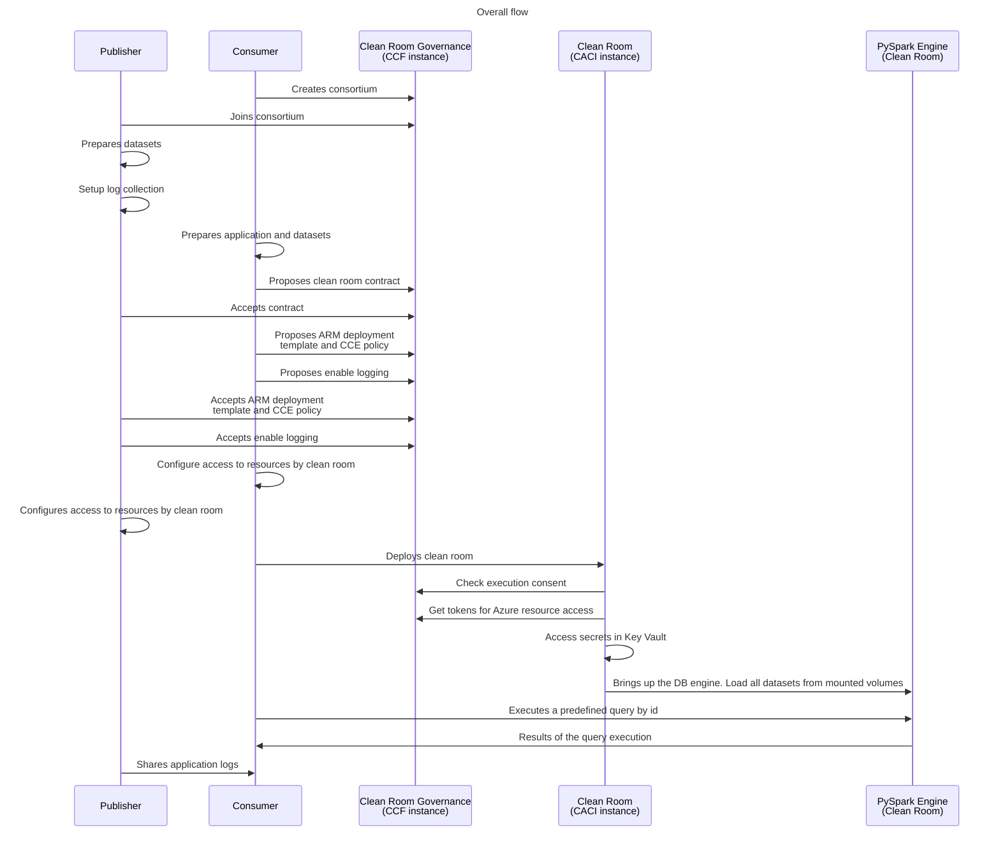

# Multi-party collaboration: Query Analytics <!-- omit from toc -->

- [1. Prerequisites](#1-prerequisites)
- [2. Scenarios demonstrated by this sample](#2-scenarios-demonstrated-by-this-sample)
- [3. High level execution sequence](#3-high-level-execution-sequence)
- [4. Setup the consortium](#4-setup-the-consortium)
- [5. Publisher: Preparing encrypted datasets](#5-publisher-preparing-encrypted-datasets)
- [6. Publisher: Setting up log collection](#6-publisher-setting-up-log-collection)
- [7. Share publisher clean room configuration with consumer](#7-share-publisher-clean-room-configuration-with-consumer)
- [8. Consumer: Preparing encrypted datasets](#8-consumer-preparing-encrypted-datasets)
- [9. Consumer: Application configuration and mount points](#9-consumer-application-configuration-and-mount-points)
  - [9.1. Mounting storage containers using Blobfuse2](#91-mounting-storage-containers-using-blobfuse2)
  - [9.2  Define network policy to allow any network traffic on the application port](#92--define-network-policy-to-allow-any-network-traffic-on-the-application-port)
- [10. Propose governance contract](#10-propose-governance-contract)
- [11. Agreeing upon the contract](#11-agreeing-upon-the-contract)
- [12. Propose ARM template, CCE policy and log collection](#12-propose-arm-template-cce-policy-and-log-collection)
- [13. Accept ARM template, CCE policy and logging proposals](#13-accept-arm-template-cce-policy-and-logging-proposals)
- [14. Setup access for the clean room](#14-setup-access-for-the-clean-room)
- [15. Define Queries](#15-define-queries)
- [16. Deploy clean room](#16-deploy-clean-room)
- [17. Executing queries](#17-executing-queries)
- [18. Next Steps](#18-next-steps)

# 1. Prerequisites
This guide assumes you have finished the prerequisite steps in the previous sample [multi-party collaboration sample prerequisites](../../README.md#3-prerequisites) successfully.

# 2. Scenarios demonstrated by this sample
This sample demonstrates the following capabilities:
- A publisher (party 1) that has dataset(s) which is meant to be consumed via the collaboration.
- A consumer (party 2) that wants to run a engine that loads the data shared by the publisher. This party might also bring in its own dataset(s) into the collaboration.
- Propose & use verified queries on the datasets and get results back as query output.

A confidential clean room (CCR) will be setup to run the consumer's application while protecting the privacy of the data that is ingested or created as output for both the publisher and the consumer. This samples uses the [PySpark](https://pypi.org/project/pyspark/) engine to load the DB's into the memory, to demonstrate the approach which can be customized to real world scenarios.

# 3. High level execution sequence
Before we begin below gives the overall flow of execution that happens in this sample. It gives a high level perspective that might be helpful to keep in mind as you run thru the steps.


# 4. Setup the consortium
Follow the steps to [create a consortium](../../README.md#5-setup-the-consortium) as in the main 
sample. You can reuse the consortium if it was setup already.
 
# 5. Publisher: Preparing encrypted datasets
Follow the steps to [prepare datasets](../../README.md#6-publisher-preparing-encrypted-datasets) as in the main sample with a minor difference: for the command "az cleanroom datasource upload" use the dataset-folder value as "./scenarios/analytics/publisher-demo/publisher-input"

# 6. Publisher: Setting up log collection
Follow the steps to [setup log collection](../../README.md#7-publisher-setting-up-log-collection) as in the main 
sample.

# 7. Share publisher clean room configuration with consumer
For the consumer to configure their application to access the data from the publisher it needs to know the details about the datasources that have been prepared by the publisher. Eg the consumer needs to refer to the individual datasources by their name when specifying where to mount each datasource in the container. The publisher needs to share the `publisher-config` file with the consumer.

# 8. Consumer: Preparing encrypted datasets
In your `consumer-demo` directory in this sample, initialize a clean room configuration file named `consumer-config` with the below command:
```powershell
$consumerConfig = "./consumer-demo/consumer-config"
az cleanroom config init --cleanroom-config $consumerConfig
```
The above command creates the file with the below content:
```
identities: []
specification:
  applications: []
  datasinks: []
  datasources: []
  telemetry: {}
```
```powershell
$consumerResourceGroup = "consumer-$((New-Guid).ToString().Substring(0, 8))"

# Create storage account, KV and MI resources.
$resultconsumer = (./prepare-resources.ps1 -resourceGroup $consumerResourceGroup -kvType akvpremium)

# Create a KEK entry in the configuration.
az cleanroom config set-kek `
    --kek-key-vault $resultconsumer.kek.kv.id `
    --maa-url $resultconsumer.maa_endpoint `
    --cleanroom-config $consumerConfig

az cleanroom config add-datasource `
    --cleanroom-config $consumerConfig `
    --name consumer-input `
    --storage-account $resultconsumer.sa.id `
    --identity $resultconsumer.mi.id `
    --dek-key-vault $resultconsumer.dek.kv.id

# Encrypt and upload content.
az cleanroom datasource upload `
    --cleanroom-config $consumerConfig `
    --name consumer-input `
    --dataset-folder ./scenarios/analytics/consumer-demo/consumer-input
```

# 9. Consumer: Application configuration and mount points
The application details such as the app name, container registry, image ID, command, environment variables and resources needs to be captured as below. Replace the values for the parameters as appropriate.

The sample application is located at `consumer-demo/application` directory. The below command adds the application details to the configuration file.
```powershell
az cleanroom config add-application `
    --cleanroom-config $consumerConfig `
    --name demo-app `
    --image "multipartycolab.azurecr.io/query-analytics@sha256:f4e025a70000a0e71f5e7ef941ad038f5c41f264be3b0ee51741c991e42c08be" `
    --command "python3.10 ./analytics.py" `
    --mounts "src=publisher-input,dst=/mnt/remote/publisher-input" `
             "src=consumer-input,dst=/mnt/remote/consumer-input" `
    --env-vars STORAGE_PATH_1=/mnt/remote/publisher-input `
               STORAGE_PATH_2=/mnt/remote/consumer-input `
    --ports 8310 `
    --cpu 0.5 `
    --memory 4
```
Note: The value for ports (8310) added here is the port on which the application is listening with an API /app/run_query/"document_id" for the query-document ids (defined earlier). Adding the ports in the application configuration here, redirects the traffic from the publicIP to the application port through an envoy proxy.

## 9.1. Mounting storage containers using Blobfuse2
The `--mounts` flag allows you to mount a datasource or datasink in a container. `--mount` consists of multiple key-value pairs, separated by commas and each consisting of a `key=value` tuple.
- `src`: The source of the mount. This is the `name` of a `datasource` or `datasink` that needs to be mounted. Eg in this sample `publisher-input` is the datasource name present in `publisher-config` while `consumer-output` is the datasink name present in `consumer-config`.
- `dst`: The destination takes as its value the path where the datasource/datasink gets mounted in the container.

During clean room execution each of the `src` mounts that are mentioned above get exposed transparently as file system mount points using [Azure Storage Blosefuse2](https://github.com/Azure/azure-storage-fuse/tree/main?tab=readme-ov-file#about) driver. The application container reads clear text data and writes clear text data to/from the `src` mountpoint(s) and does not need to deal with any encryption/decryption semantics. The blob fuse driver transparently decrypts (for application reads) and encrypts (for application writes) using the [DEK](#61-kek-dek-based-encryption-approach) that gets released during clean room execution.

The resources for the application container should be allocated so as not to violate confidential ACI limits as defined [here](https://learn.microsoft.com/en-us/azure/container-instances/container-instances-resource-and-quota-limits#confidential-container-resources-preview).

## 9.2  Define network policy to allow any network traffic on the application port
> [!WARNING]
> Opening up the network connectivity for the application container increases the burden of establishing trust between the publisher and consumer. The publisher must ensure that the application code is audited by them and is performing actions in line with the agreement between the parties. The platform can't provide exfiltration guarantees. Hence, even the queries should be predefined and agreed by both parties before execution. Alternately, OPA rules can be defined to accept/reject traffic by parsing the data.

```powershell
az cleanroom config set-network-policy `
    --allow-all `
    --cleanroom-config $consumerConfig
```

# 10. Propose governance contract
Follow the steps to [propose a contract](../../README.md#10-proposing-a-governance-contract) as in the main sample with the change of `$contractId` value to `collab1-qa`.

# 11. Agreeing upon the contract
Follow [agreeing upon the contract](../../README.md#11-agreeing-upon-the-contract) as in the main sample.

# 12. Propose ARM template, CCE policy and log collection
Follow [Propose ARM template, CCE policy and log collection](../../README.md#12-propose-arm-template-cce-policy-and-log-collection) as in the main 
sample.

# 13. Accept ARM template, CCE policy and logging proposals
Follow [Accept ARM template, CCE policy and logging proposals](../../README.md#13-accept-arm-template-cce-policy-and-logging-proposals) as in the main 
sample.

# 14. Setup access for the clean room
Follow the [Setup access for the clean room](../../README.md#14-setup-access-for-the-clean-room) as in the main sample.

# 15. Define Queries
This is the step where the consumer proposes the queries that can be executed in the clean room and the publisher votes on them. Only those queries which get accepted by the publisher can then be executed by the application. The commands below can also be executed after the deployment of the clean room, to propose and execute other queries.

```powershell
# Create a document with query.
$data = "SELECT author, COUNT(*) AS Number_Of_Mentions FROM COMBINED_TWEETS WHERE mentions LIKE '%MikeDoesBigData%'  GROUP BY author ORDER BY Number_Of_Mentions DESC"
$documentId="12"
az cleanroom governance document create `
    --data $data `
    --id $documentId `
    --contract-id $contractId `
    --governance-client "consumer-client"

$version=az cleanroom governance document show `
    --id $documentId `
    --governance-client "consumer-client" `
    | jq -r ".version"

# Submitting a document proposal.
$proposalId=az cleanroom governance document propose `
    --version $version `
    --id $documentId `
    --governance-client "consumer-client" `
    | jq -r '.proposalId'
```

Once the query is proposed, it has to be voted by all members.

Voting as the consumer:
```powershell
az cleanroom governance document vote `
    --id $documentId `
    --proposal-id $proposalId `
    --action accept `
    --governance-client "consumer-client" `
    | jq
```

Voting as the publisher:
```powershell

# Retrieve the proposalId for the documentId
$documentId="12"
$proposalId=az cleanroom governance document show `
    --id $documentId `
    --governance-client "publisher-client" `
    | jq -r '.proposalId'

az cleanroom governance document vote `
    --id $documentId `
    --proposal-id $proposalId `
    --action accept `
    --governance-client "publisher-client" `
    | jq
```

# 16. Deploy clean room
Follow [Deploy clean room](../../README.md#15-deploy-clean-room) as in the main sample.

# 17. Executing queries
As the application is listening on the port 8310, the consumer needs to send the request specifying the query id on the public IP of the container group. The demo app container traces should show "Serving Flask app", before you can start querying as the Spark engine takes some time (~5mins) to load the DBs.

First, get the public ip of the container group:
```powershell
$ccrIP = az container show `
    --name $cleanRoomName `
    -g $consumerResourceGroup `
    --query "ipAddress.ip" `
    --output tsv
```

Now execute the query with the documentId defined earlier:
```powershell
curl -k https://$ccrIP:8310/app/run_query/$documentId
```

# 18. Next Steps
- See how to [perform a code change](../code-change/README.md) for the application container and redeploy a new clean room instance.
- See how to [perform upgrades](../upgrade/README.md) of the cleanroom infrastructure components.